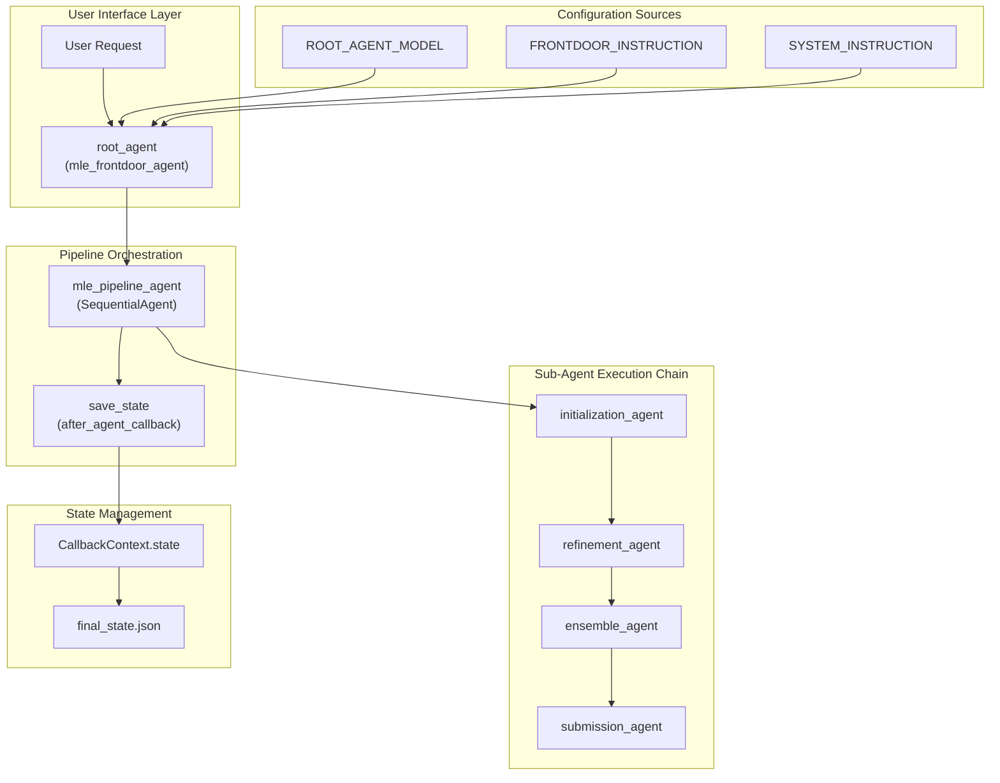
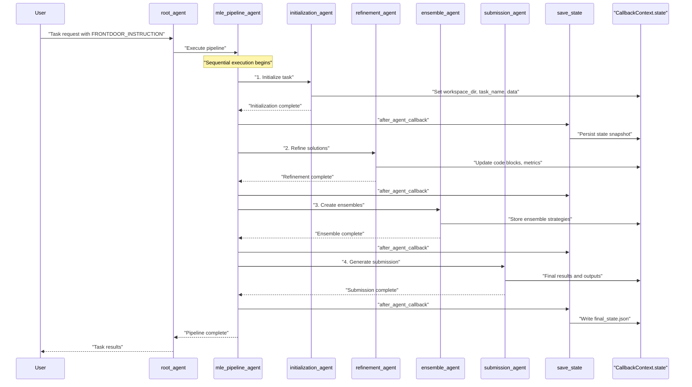
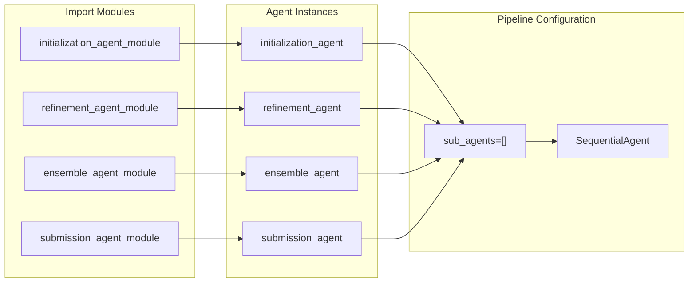
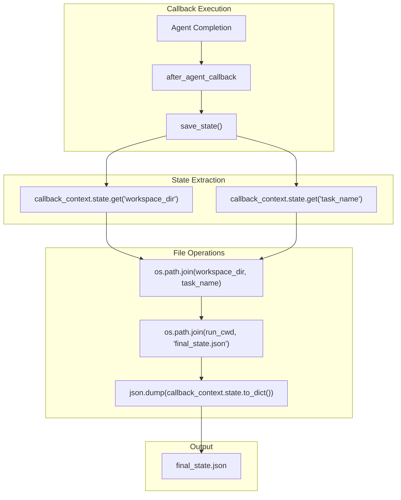
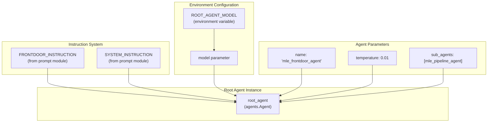

# Agent Pipeline

Relevant source files

The following files were used as context for generating this wiki page:

- [machine_learning_engineering/agent.py](machine_learning_engineering/agent.py)

## Purpose and Scope

The Agent Pipeline is the core orchestration mechanism of the MLE-STAR system, responsible for executing a sequential chain of specialized agents to solve machine learning engineering tasks. This pipeline coordinates the execution flow from task initialization through final submission, managing state persistence and inter-agent communication.

This document covers the pipeline architecture, execution flow, and state management. For configuration of individual sub-agents, see [Sub-Agents](#3). For system-wide configuration and setup, see [Configuration and Setup](#1.2).

## Pipeline Architecture Overview

The Agent Pipeline consists of two main components: the `mle_pipeline_agent` which orchestrates the sequential execution, and the `root_agent` which serves as the user-facing frontdoor interface.

### Core Pipeline Components

*Sources: [machine_learning_engineering/agent.py:30-50]()*

### Agent Class Hierarchy

The pipeline leverages the Google ADK's agent framework with specific agent types for different roles:

| Component | Class Type | Purpose |
|-----------|------------|---------|
| `root_agent` | `agents.Agent` | User-facing interface with system instructions |
| `mle_pipeline_agent` | `agents.SequentialAgent` | Orchestrates sub-agent execution |
| Sub-agents | `agents.Agent` | Specialized task handlers |

*Sources: [machine_learning_engineering/agent.py:30-40](), [machine_learning_engineering/agent.py:43-50]()*

## Sequential Agent Execution Flow

The `mle_pipeline_agent` implements a strict sequential execution pattern where each sub-agent builds upon the work of its predecessors.

### Execution Sequence Diagram

*Sources: [machine_learning_engineering/agent.py:32-37](), [machine_learning_engineering/agent.py:39]()*

### Sub-Agent Import Structure

The pipeline imports and orchestrates four specialized sub-agents:

*Sources: [machine_learning_engineering/agent.py:10-13](), [machine_learning_engineering/agent.py:32-37]()*

## State Management and Persistence

The pipeline maintains execution state through the `CallbackContext.state` mechanism, with automatic persistence after each agent execution.

### State Persistence Mechanism

The `save_state` function implements the callback mechanism for persisting agent execution state:

*Sources: [machine_learning_engineering/agent.py:18-27]()*

### State Schema and Structure

The state persisted by the `save_state` callback includes:

| State Key | Purpose | Set By |
|-----------|---------|---------|
| `workspace_dir` | Working directory path | Initialization Agent |
| `task_name` | Current task identifier | Initialization Agent |
| Additional state | Agent-specific data | Each sub-agent |

The state is serialized as JSON with 2-space indentation for readability and debugging.

*Sources: [machine_learning_engineering/agent.py:22-26]()*

## Root Agent and Frontdoor Interface

The `root_agent` serves as the primary interface point for the entire MLE-STAR system, configured with system-level instructions and model parameters.

### Root Agent Configuration

*Sources: [machine_learning_engineering/agent.py:43-50](), [machine_learning_engineering/agent.py:15]()*

### Agent Naming Convention

The system follows specific naming conventions required by the ADK framework:

- **`root_agent`**: Required name for ADK tools compatibility
- **`mle_frontdoor_agent`**: Descriptive name field for the root agent
- **`mle_pipeline_agent`**: Sequential orchestration agent name

This naming structure ensures proper integration with Google ADK's agent evaluation and deployment systems.

*Sources: [machine_learning_engineering/agent.py:42-45]()*