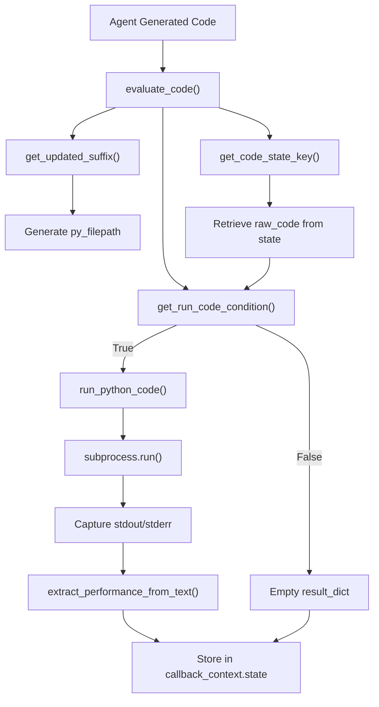
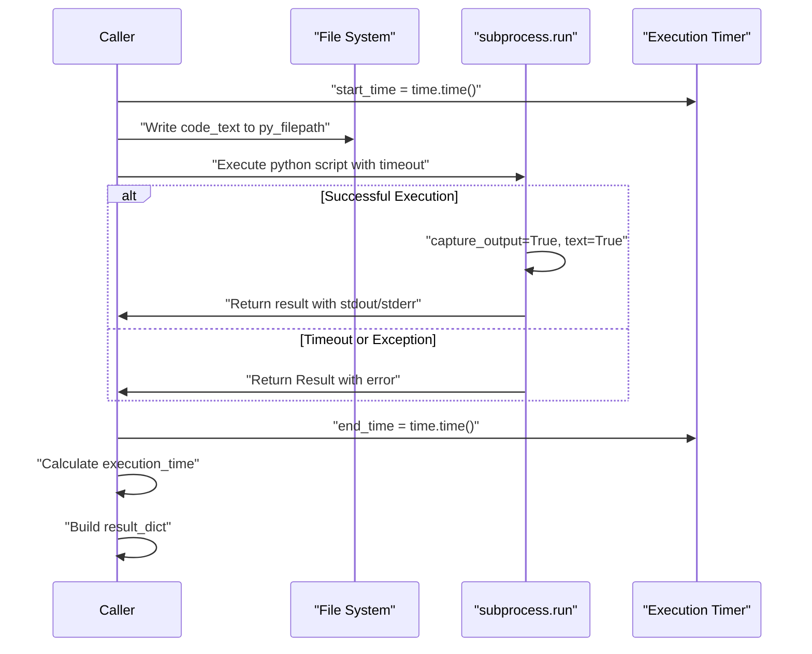
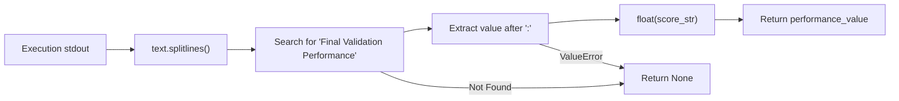
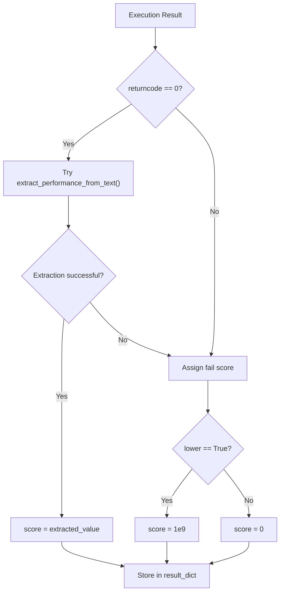
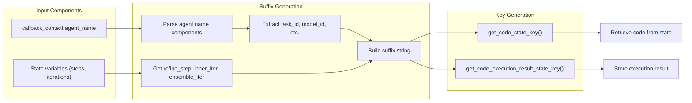
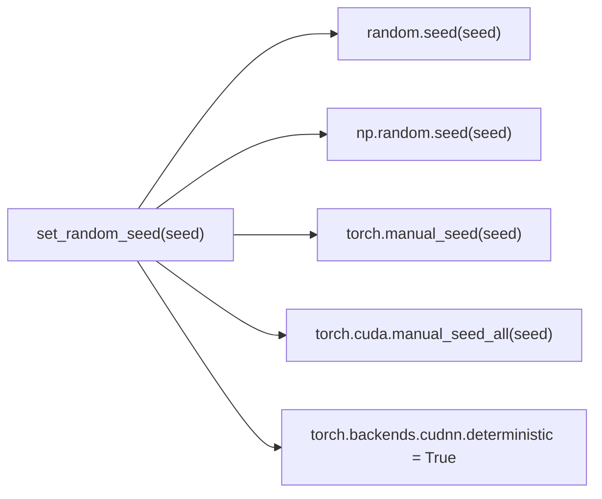

# Code Execution System

<details>
<summary>Relevant source files</summary>

The following files were used as context for generating this wiki page:

- [machine_learning_engineering/shared_libraries/code_util.py](machine_learning_engineering/shared_libraries/code_util.py)
- [machine_learning_engineering/shared_libraries/common_util.py](machine_learning_engineering/shared_libraries/common_util.py)

</details>


## Purpose and Scope

The Code Execution System provides dynamic Python code execution capabilities for the MLE-STAR agent pipeline. This system handles the secure execution of machine learning code generated by various agents, extracts performance metrics from execution results, and manages the integration with the agent state system. For information about the debugging and error handling aspects of code execution, see [Debugging System](#4.3). For details about configuration management that controls execution parameters, see [Configuration Management](#4.1).

The system supports execution contexts for different agent types including initialization, refinement, ensemble, and submission phases, with specialized handling for performance extraction and result validation.

## Core Execution Architecture

The code execution system operates through a subprocess-based execution model that provides isolation and timeout control for running generated Python code.

### Execution Flow Overview



**Sources:** [machine_learning_engineering/shared_libraries/code_util.py:187-264]()

### Code Execution Function

The core execution is handled by `run_python_code()` which manages the subprocess execution with timeout control:



**Sources:** [machine_learning_engineering/shared_libraries/code_util.py:18-46]()

## Agent-Specific Execution Contexts

The system handles different execution contexts based on agent types, with each having specific file naming conventions and execution criteria.

### Agent Type Classification

```mermaid
graph TB
    subgraph "Agent Types"
        ModelEval["model_eval_*"]
        Merger["merger_*"]
        CheckData["check_data_use_*"]
        Ablation["ablation_*"]
        PlanImplement["plan_implement_*"]
        EnsemblePlan["ensemble_plan_implement_*"]
        Submission["submission_*"]
    end
    
    subgraph "File Naming Patterns"
        ModelEval --> InitCode["init_code_{model_id}.py"]
        Merger --> TrainCode["train0_{reference_idx}.py"]
        CheckData --> Train0["train0.py"]
        Ablation --> AblationCode["ablation_{step}.py"]
        PlanImplement --> TrainImprove["train{step}_improve{inner_iter}.py"]
        EnsemblePlan --> EnsembleCode["ensemble{suffix}.py"]
        Submission --> FinalSolution["final_solution.py"]
    end
    
    subgraph "State Key Patterns"
        ModelEval --> InitStateKey["init_code_{suffix}"]
        Merger --> MergerStateKey["merger_code_{suffix}"]
        CheckData --> TrainStateKey["train_code_0_{suffix}"]
        Ablation --> AblationStateKey["ablation_code_{suffix}"]
        PlanImplement --> ImproveStateKey["train_code_improve_{suffix}"]
        EnsemblePlan --> EnsembleStateKey["ensemble_code_{suffix}"]
        Submission --> SubmissionStateKey["submission_code"]
    end
```



**Sources:** [machine_learning_engineering/shared_libraries/code_util.py:114-135](), [machine_learning_engineering/shared_libraries/code_util.py:200-227]()

### Execution Condition Logic

The system implements specific conditions for when code should be executed based on agent type and code content:

| Agent Type | Execution Condition |
|------------|-------------------|
| `ensemble_plan_implement` | Always run if not debug_agent, or if contains "Final Validation Performance" and no "exit()" |
| `ablation` | Always run if not debug_agent, or if no "exit()" |
| `submission` | Run if not debug_agent and no "exit()" and contains "submission.csv", or if debug_agent and no "exit()" |
| Others | Run if contains "Final Validation Performance" and no "exit()" |

**Sources:** [machine_learning_engineering/shared_libraries/code_util.py:162-184]()

## Performance Extraction and Scoring

The system extracts performance metrics from execution output and converts them to numerical scores for agent evaluation.

### Performance Text Parsing



The `extract_performance_from_text()` function searches for lines containing "Final Validation Performance" and extracts the numerical value that follows the colon separator.

**Sources:** [machine_learning_engineering/shared_libraries/code_util.py:49-62]()

### Score Assignment Logic

The scoring system handles both successful and failed executions:



**Sources:** [machine_learning_engineering/shared_libraries/code_util.py:248-256]()

## State Management Integration

The code execution system integrates tightly with the agent state management through the `CallbackContext` interface.

### State Key Generation



**Sources:** [machine_learning_engineering/shared_libraries/code_util.py:79-111](), [machine_learning_engineering/shared_libraries/code_util.py:138-159]()

### Execution Context Setup

The system constructs execution environments based on workspace configuration and agent context:

| Component | Source | Usage |
|-----------|--------|-------|
| `workspace_dir` | `callback_context.state` | Base directory for all executions |
| `task_name` | `callback_context.state` | Task identifier for directory structure |
| `task_id` | Derived from agent name | Specific task instance |
| `run_cwd` | Computed path | Working directory for code execution |
| `exec_timeout` | `callback_context.state` | Execution timeout in seconds |

**Sources:** [machine_learning_engineering/shared_libraries/code_util.py:232-240]()

## Common Utilities Integration

The code execution system leverages shared utilities for enhanced functionality:

### Random Seed Management

The system can utilize `set_random_seed()` from common utilities to ensure reproducible execution environments:



**Sources:** [machine_learning_engineering/shared_libraries/common_util.py:25-33]()

### File Management

The `copy_file()` utility supports workspace setup and file management operations needed for code execution environments.

**Sources:** [machine_learning_engineering/shared_libraries/common_util.py:36-40]()

## Error Handling and Execution Results

The system provides comprehensive error handling and result packaging for robust agent operation:

### Result Structure

Every code execution returns a standardized result dictionary:

```python
result_dict = {
    "returncode": int,      # Process exit code
    "stdout": str,          # Standard output capture
    "stderr": str,          # Standard error capture  
    "execution_time": float, # Execution duration in seconds
    "score": float,         # Extracted performance score (non-ablation)
    "ablation_result": str  # Ablation-specific result (ablation agents only)
}
```

### Exception Handling

The subprocess execution includes timeout and exception handling through a custom `Result` class that ensures consistent error reporting even when subprocess operations fail.

**Sources:** [machine_learning_engineering/shared_libraries/code_util.py:11-16](), [machine_learning_engineering/shared_libraries/code_util.py:28-46]()