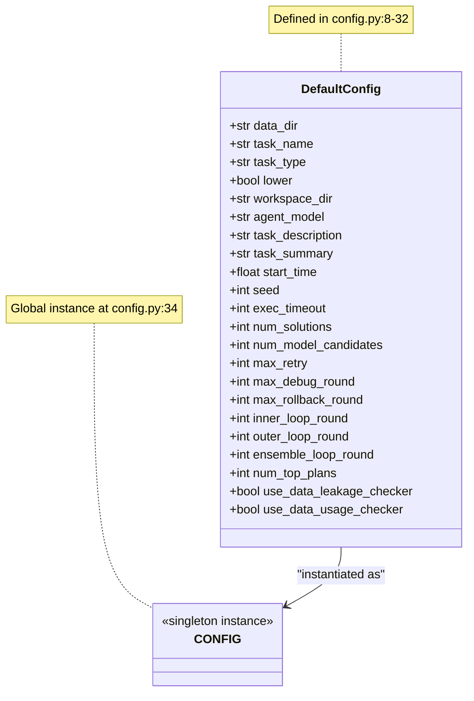
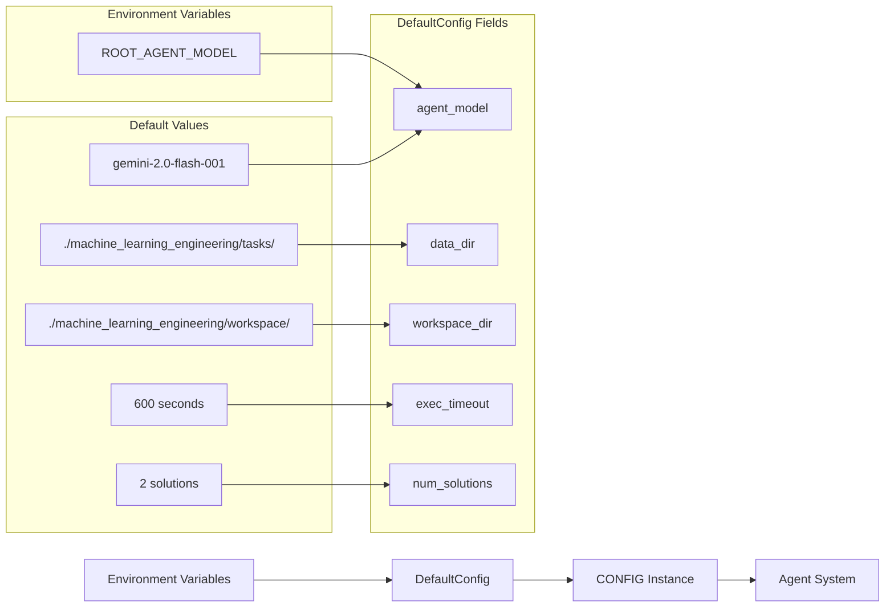

# Configuration Management

<details>
<summary>Relevant source files</summary>

The following files were used as context for generating this wiki page:

- [machine_learning_engineering/shared_libraries/config.py](machine_learning_engineering/shared_libraries/config.py)

</details>


This document covers the centralized configuration system for the MLE-STAR machine learning engineering agent. The configuration management provides default values, parameter definitions, and settings that control agent behavior, execution timeouts, task parameters, and system features.

For backend selection and environment setup, see [Configuration and Setup](#1.2). For agent initialization and pipeline configuration, see [Agent Pipeline](#2.1).

## Configuration Structure

The configuration system is implemented through a single `DefaultConfig` dataclass that centralizes all system parameters. This approach provides type safety, default values, and easy parameter access throughout the agent system.



**Sources:** [machine_learning_engineering/shared_libraries/config.py:7-34]()

## Configuration Categories

The `DefaultConfig` class organizes parameters into logical categories based on their functional purpose within the system:

| Category | Parameters | Purpose |
|----------|------------|---------|
| **Task Configuration** | `data_dir`, `task_name`, `task_type`, `task_description`, `task_summary`, `lower` | Define the ML task and data location |
| **Workspace Management** | `workspace_dir`, `start_time`, `seed` | Control execution environment and reproducibility |
| **Model Selection** | `agent_model`, `num_model_candidates` | Specify LLM model and candidate selection |
| **Execution Control** | `exec_timeout`, `max_retry`, `num_solutions` | Manage timeouts, retries, and solution generation |
| **Loop Configuration** | `inner_loop_round`, `outer_loop_round`, `ensemble_loop_round`, `max_debug_round`, `max_rollback_round` | Control iterative refinement processes |
| **Plan Management** | `num_top_plans` | Strategy selection parameters |
| **Feature Flags** | `use_data_leakage_checker`, `use_data_usage_checker` | Enable/disable validation features |

**Sources:** [machine_learning_engineering/shared_libraries/config.py:10-31]()

## Environment Integration

The configuration system integrates with environment variables to allow runtime customization while maintaining sensible defaults:



**Sources:** [machine_learning_engineering/shared_libraries/config.py:15]()

## Task and Data Configuration

Task-specific configuration controls how the system loads and processes machine learning problems:

- **`data_dir`**: Base directory containing task datasets and definitions [machine_learning_engineering/shared_libraries/config.py:10]()
- **`task_name`**: Identifier for the specific task, defaults to `"california-housing-prices"` [machine_learning_engineering/shared_libraries/config.py:11]()
- **`task_type`**: Classification of the ML problem type, defaults to `"Tabular Regression"` [machine_learning_engineering/shared_libraries/config.py:12]()
- **`lower`**: Boolean indicating if lower metric values represent better performance [machine_learning_engineering/shared_libraries/config.py:13]()

**Sources:** [machine_learning_engineering/shared_libraries/config.py:10-13]()

## Execution Control Parameters

The system provides fine-grained control over execution behavior through timeout and iteration parameters:

```mermaid
graph TD
    subgraph "Timeout Configuration"
        exec_timeout["exec_timeout: 600s"]
    end
    
    subgraph "Retry Logic"
        max_retry["max_retry: 10"]
        max_debug_round["max_debug_round: 5"]
        max_rollback_round["max_rollback_round: 2"]
    end
    
    subgraph "Solution Generation"
        num_solutions["num_solutions: 2"]
        num_model_candidates["num_model_candidates: 2"]
        num_top_plans["num_top_plans: 2"]
    end
    
    subgraph "Iteration Control"
        inner_loop_round["inner_loop_round: 1"]
        outer_loop_round["outer_loop_round: 1"] 
        ensemble_loop_round["ensemble_loop_round: 1"]
    end
    
    exec_timeout --> EXECUTION["Task Execution"]
    max_retry --> EXECUTION
    max_debug_round --> DEBUG["Debug Process"]
    max_rollback_round --> DEBUG
    
    num_solutions --> GENERATION["Solution Generation"]
    num_model_candidates --> GENERATION
    num_top_plans --> GENERATION
    
    inner_loop_round --> ITERATION["Iterative Refinement"]
    outer_loop_round --> ITERATION
    ensemble_loop_round --> ITERATION
```



**Sources:** [machine_learning_engineering/shared_libraries/config.py:20-29]()

## Feature Flags and Validation

The configuration system includes feature flags to enable optional validation and checking capabilities:

- **`use_data_leakage_checker`**: Controls data leakage validation during pipeline execution [machine_learning_engineering/shared_libraries/config.py:30]()
- **`use_data_usage_checker`**: Enables monitoring of data usage patterns for compliance [machine_learning_engineering/shared_libraries/config.py:31]()

These flags integrate with the data validation system documented in [Data Validation](#4.4).

**Sources:** [machine_learning_engineering/shared_libraries/config.py:30-31]()

## Global Configuration Instance

The system maintains a global `CONFIG` instance that provides centralized access to configuration values throughout the codebase:

```python
CONFIG = DefaultConfig()
```

This singleton pattern ensures consistent configuration access across all system components while allowing for easy testing and configuration override scenarios.

**Sources:** [machine_learning_engineering/shared_libraries/config.py:34]()