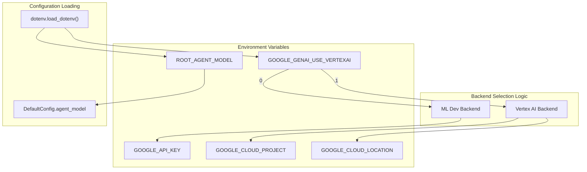
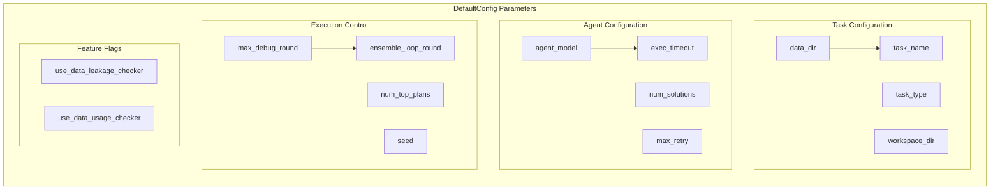
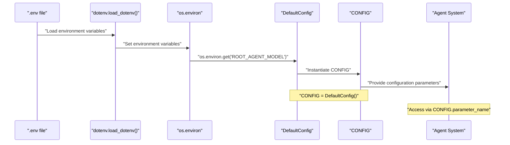

# Configuration and Setup

<details>
<summary>Relevant source files</summary>

The following files were used as context for generating this wiki page:

- [.env.example](.env.example)
- [machine_learning_engineering/shared_libraries/config.py](machine_learning_engineering/shared_libraries/config.py)

</details>


This document covers the configuration system for the MLE-STAR machine learning engineering agent, including environment variables, backend selection, and agent parameters. It explains how to set up the system for both local development and cloud deployment.

For information about system deployment, see [Deployment](#6). For details about the agent execution pipeline, see [Core Agent System](#2).

## Environment Variables and Backend Selection

The MLE-STAR system supports two backend configurations: ML Dev (API key-based) and Vertex AI (Google Cloud-based). Backend selection is controlled through environment variables defined in a `.env` file.

### Backend Configuration

The system uses the `GOOGLE_GENAI_USE_VERTEXAI` environment variable to determine which backend to use:

| Backend | Value | Required Variables |
|---------|-------|-------------------|
| ML Dev | `0` | `GOOGLE_API_KEY` |
| Vertex AI | `1` | `GOOGLE_CLOUD_PROJECT`, `GOOGLE_CLOUD_LOCATION` |

#### Environment Variables Reference



**Sources:** [.env.example:1-18]()

### Environment Variable Details

The system requires different environment variables depending on the selected backend:

**Common Variables:**
- `ROOT_AGENT_MODEL`: Specifies the LLM model (default: `gemini-2.5-flash`)

**ML Dev Backend (GOOGLE_GENAI_USE_VERTEXAI=0):**
- `GOOGLE_API_KEY`: API key for Google AI services

**Vertex AI Backend (GOOGLE_GENAI_USE_VERTEXAI=1):**
- `GOOGLE_CLOUD_PROJECT`: Google Cloud project ID
- `GOOGLE_CLOUD_LOCATION`: Google Cloud region for deployment

**Sources:** [.env.example:4-17]()

## DefaultConfig Class and Parameters

The `DefaultConfig` class in [machine_learning_engineering/shared_libraries/config.py:8-34]() centralizes all system configuration parameters. This dataclass provides default values for agent behavior, execution settings, and task parameters.

### Core Configuration Parameters



**Sources:** [machine_learning_engineering/shared_libraries/config.py:8-34]()

### Parameter Categories

#### Task Management Parameters
- `data_dir`: Directory containing ML tasks and data [line 10]()
- `task_name`: Specific task identifier (default: "california-housing-prices") [line 11]()
- `task_type`: ML problem type (default: "Tabular Regression") [line 12]()
- `workspace_dir`: Directory for intermediate outputs and logs [line 14]()

#### Agent Execution Parameters  
- `agent_model`: LLM model name from `ROOT_AGENT_MODEL` environment variable [line 15]()
- `exec_timeout`: Maximum execution time in seconds (default: 600) [line 20]()
- `num_solutions`: Number of solution attempts (default: 2) [line 21]()
- `max_retry`: Maximum retry attempts (default: 10) [line 23]()

#### Loop Control Parameters
- `max_debug_round`: Maximum debugging iterations (default: 5) [line 24]()
- `ensemble_loop_round`: Ensemble combination rounds (default: 1) [line 28]()
- `inner_loop_round`: Inner execution loop iterations (default: 1) [line 26]()
- `outer_loop_round`: Outer execution loop iterations (default: 1) [line 27]()

**Sources:** [machine_learning_engineering/shared_libraries/config.py:10-28]()

## Configuration Flow Through System

The configuration system follows a hierarchical loading pattern where environment variables override defaults, and the `DefaultConfig` instance provides system-wide settings.



**Sources:** [machine_learning_engineering/shared_libraries/config.py:15](), [machine_learning_engineering/shared_libraries/config.py:34]()

### Configuration Access Pattern

The system creates a global `CONFIG` instance that agents and utilities reference:

- **Global Instance:** `CONFIG = DefaultConfig()` [line 34]()
- **Environment Integration:** `agent_model` pulls from `os.environ.get("ROOT_AGENT_MODEL", "gemini-2.0-flash-001")` [line 15]()
- **Default Fallbacks:** All parameters have sensible defaults for immediate system operation

**Sources:** [machine_learning_engineering/shared_libraries/config.py:34](), [machine_learning_engineering/shared_libraries/config.py:15]()

## Setup Steps

### 1. Environment File Creation

Copy the example environment file and configure backend settings:

```bash
cp .env.example .env
```

Edit `.env` to specify your backend choice and credentials:

- **For ML Dev:** Set `GOOGLE_GENAI_USE_VERTEXAI=0` and provide `GOOGLE_API_KEY`
- **For Vertex AI:** Set `GOOGLE_GENAI_USE_VERTEXAI=1` and provide Google Cloud project details

**Sources:** [.env.example:1-2]()

### 2. Backend-Specific Configuration

#### ML Dev Setup
```env
GOOGLE_GENAI_USE_VERTEXAI=0
GOOGLE_API_KEY=your_actual_api_key_here
```

#### Vertex AI Setup  
```env
GOOGLE_GENAI_USE_VERTEXAI=1
GOOGLE_CLOUD_PROJECT=your-project-id
GOOGLE_CLOUD_LOCATION=us-central1
```

**Sources:** [.env.example:4-12]()

### 3. Model Configuration

Specify the LLM model in your `.env` file:
```env
ROOT_AGENT_MODEL=gemini-2.5-flash
```

This value is automatically loaded by `DefaultConfig.agent_model` through `os.environ.get()`.

**Sources:** [.env.example:17](), [machine_learning_engineering/shared_libraries/config.py:15]()

### 4. Configuration Validation

The system will automatically validate configuration on startup:

- Environment variables are loaded via `dotenv.load_dotenv()`
- Backend selection is validated based on `GOOGLE_GENAI_USE_VERTEXAI` value
- Missing required variables for the selected backend will cause initialization failures

**Sources:** [machine_learning_engineering/shared_libraries/config.py:4](), [.env.example:4-5]()