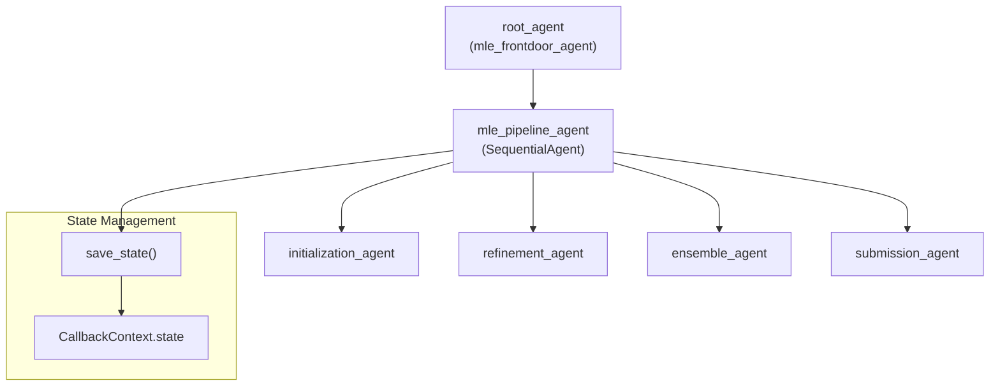
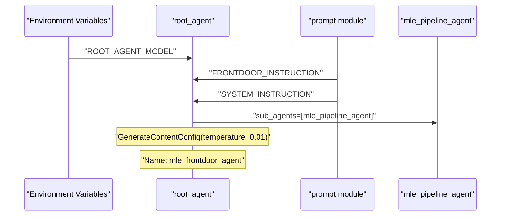
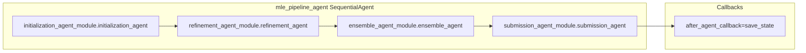
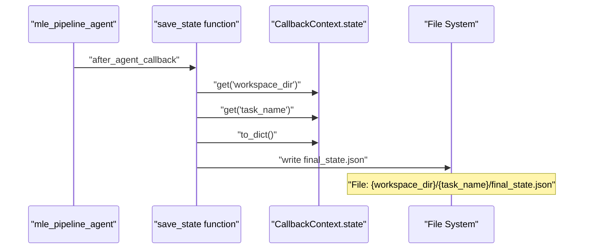
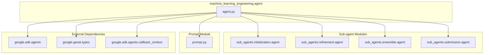

# Core Agent System

Relevant source files

The following files were used as context for generating this wiki page:

- [machine_learning_engineering/agent.py](machine_learning_engineering/agent.py)
- [machine_learning_engineering/prompt.py](machine_learning_engineering/prompt.py)

## Purpose and Scope

This document provides a deep dive into the main MLE-STAR agent pipeline and execution flow. The core agent system serves as the orchestration layer that coordinates machine learning engineering tasks through a sequential multi-agent architecture.

For detailed information about individual sub-agents and their specific functionalities, see [Sub-Agents](#3). For system configuration and environment setup, see [Configuration and Setup](#1.2). For detailed pipeline execution flow, see [Agent Pipeline](#2.1), and for instruction definitions, see [Instructions and Prompts](#2.2).

## System Architecture Overview

The core agent system implements a two-tier architecture with a root agent that delegates to a sequential pipeline agent, which in turn orchestrates specialized sub-agents.

### Core Agent Hierarchy

**Sources:** [machine_learning_engineering/agent.py:30-50]()

## Root Agent Structure

The `root_agent` serves as the primary entry point and is configured with specific instructions and model parameters. It implements the frontdoor pattern where initial user interactions are handled before delegating to the pipeline.

### Root Agent Configuration

| Component | Value | Source |
|-----------|-------|---------|
| Agent Name | `mle_frontdoor_agent` | [agent.py:45]() |
| Model | `os.getenv("ROOT_AGENT_MODEL")` | [agent.py:44]() |
| Instruction | `prompt.FRONTDOOR_INSTRUCTION` | [agent.py:46]() |
| Global Instruction | `prompt.SYSTEM_INSTRUCTION` | [agent.py:47]() |
| Temperature | 0.01 | [agent.py:49]() |

The root agent uses the ADK naming convention where the main agent must be named `root_agent` for tool compatibility [machine_learning_engineering/agent.py:42-43]().

### Agent Instantiation Flow

**Sources:** [machine_learning_engineering/agent.py:43-50](), [machine_learning_engineering/prompt.py:4-26]()

## Sequential Pipeline Architecture

The `mle_pipeline_agent` implements the core orchestration logic using the `SequentialAgent` pattern from the ADK framework. This agent executes four specialized sub-agents in sequence.

### Pipeline Configuration

The pipeline agent is configured with the following parameters:

| Parameter | Value | Purpose |
|-----------|-------|---------|
| `name` | `"mle_pipeline_agent"` | Agent identifier |
| `sub_agents` | List of 4 agents | Sequential execution order |
| `description` | Task execution description | Agent documentation |
| `after_agent_callback` | `save_state` function | State persistence |

**Sources:** [machine_learning_engineering/agent.py:30-40]()

## State Management System

The core agent system implements comprehensive state management through the `CallbackContext.state` mechanism, with automatic persistence after each agent execution.

### State Persistence Flow

### State Save Implementation

The `save_state` function [machine_learning_engineering/agent.py:18-27]() implements the following logic:

1. Extracts `workspace_dir` and `task_name` from callback context state
2. Constructs output directory path: `{workspace_dir}/{task_name}`
3. Serializes entire state to `final_state.json` with 2-space indentation
4. Returns `None` to indicate no content response

**Sources:** [machine_learning_engineering/agent.py:18-27]()

## Agent Import Structure

The core agent system imports sub-agents through a modular structure that maintains clear separation of concerns:

Each sub-agent module exposes its agent instance through a standardized naming convention, allowing the pipeline to reference them as `{module_name}.{agent_name}` [machine_learning_engineering/agent.py:10-13]().

**Sources:** [machine_learning_engineering/agent.py:1-16]()