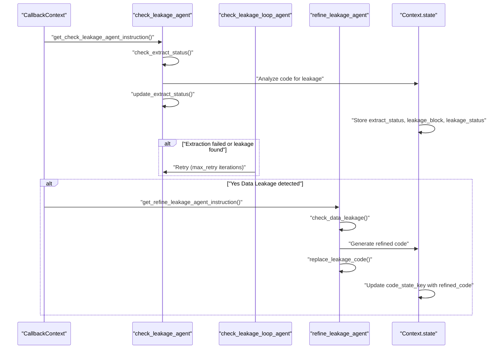
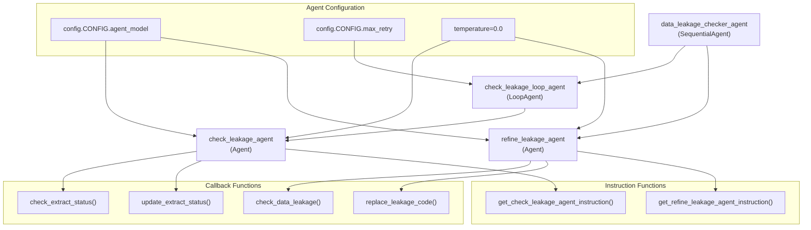
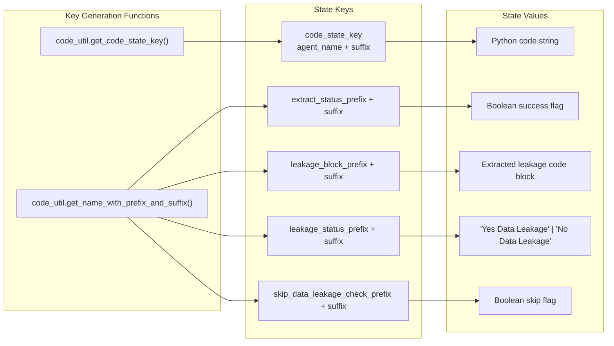
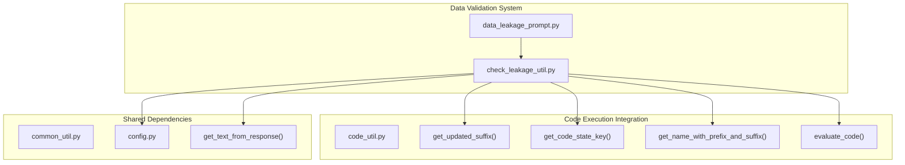

# Data Validation

Relevant source files

The following files were used as context for generating this wiki page:

- [machine_learning_engineering/shared_libraries/check_leakage_util.py](machine_learning_engineering/shared_libraries/check_leakage_util.py)
- [machine_learning_engineering/shared_libraries/data_leakage_prompt.py](machine_learning_engineering/shared_libraries/data_leakage_prompt.py)

This document covers the data validation system within the MLE-STAR shared libraries, specifically focusing on data leakage detection and prevention utilities. The system provides automated detection of data leakage issues in machine learning code and offers refinement capabilities to fix identified problems.

For information about code execution and evaluation, see [Code Execution System](#4.2). For debugging and error handling utilities, see [Debugging System](#4.3).

## Overview

The data validation system is primarily implemented through the data leakage detection framework, which uses LLM agents to analyze machine learning code for potential data leakage issues. Data leakage occurs when information from validation or test datasets inadvertently influences the training process, leading to overly optimistic performance estimates.

The system operates through a two-stage process: detection and refinement. It analyzes code blocks to identify where validation and test samples might be improperly preprocessed using training data, then provides automated fixes when issues are found.

Sources: [machine_learning_engineering/shared_libraries/check_leakage_util.py:1-17]()

## Data Leakage Detection Workflow

The data leakage detection process follows a sequential workflow with retry logic and state management:

### Detection and Refinement Sequence

Sources: [machine_learning_engineering/shared_libraries/check_leakage_util.py:182-252](), [machine_learning_engineering/shared_libraries/check_leakage_util.py:107-129]()

## Agent Architecture

The data leakage detection system is built using a hierarchical agent structure with specialized roles:

### Agent Hierarchy and Code Entities

Sources: [machine_learning_engineering/shared_libraries/check_leakage_util.py:182-252](), [machine_learning_engineering/shared_libraries/check_leakage_util.py:187-208]()

### Agent Responsibilities

| Agent | Type | Purpose | Key Functions |
|-------|------|---------|---------------|
| `data_leakage_checker_agent` | SequentialAgent | Orchestrates the complete leakage detection and refinement process | `get_data_leakage_checker_agent()` |
| `check_leakage_loop_agent` | LoopAgent | Retries leakage detection until successful extraction | Max iterations from `config.CONFIG.max_retry` |
| `check_leakage_agent` | Agent | Analyzes code for data leakage patterns | `get_check_leakage_agent_instruction()` |
| `refine_leakage_agent` | Agent | Generates refined code to fix leakage issues | `get_refine_leakage_agent_instruction()` |

Sources: [machine_learning_engineering/shared_libraries/check_leakage_util.py:240-252](), [machine_learning_engineering/shared_libraries/check_leakage_util.py:209-220]()

## Prompt System

The data validation system uses structured prompts to guide LLM agents in detecting and fixing data leakage issues:

### Prompt Templates and Validation Logic

| Prompt | Purpose | Output Format | Key Requirements |
|--------|---------|---------------|------------------|
| `CHECK_LEAKAGE_INSTR` | Detect data leakage in code | JSON: `{'leakage_status': str, 'code_block': str}` | Identifies validation/test preprocessing issues |
| `LEAKAGE_REFINE_INSTR` | Generate fixed code | Single markdown code block | Ensures proper train/validation/test separation |

The `CHECK_LEAKAGE_INSTR` template focuses on four critical validation points:
- Validation and test samples preprocessed using training samples
- Model trained only with training samples  
- Model not trained on validation samples before scoring
- Proper preprocessing to prevent information leakage

Sources: [machine_learning_engineering/shared_libraries/data_leakage_prompt.py:3-21](), [machine_learning_engineering/shared_libraries/data_leakage_prompt.py:23-36]()

## State Management

The data validation system maintains execution state through the `CallbackContext.state` mechanism, using structured keys for different data types:

### State Key Structure

Sources: [machine_learning_engineering/shared_libraries/check_leakage_util.py:61-104](), [machine_learning_engineering/shared_libraries/check_leakage_util.py:25-32]()

### Key Functions for State Management

| Function | Purpose | State Operations |
|----------|---------|------------------|
| `parse_leakage_status()` | Extract structured data from LLM response | Parses JSON to get `leakage_status` and `code_block` |
| `update_extract_status()` | Store detection results | Sets `extract_status`, `leakage_block`, `leakage_status` keys |
| `check_extract_status()` | Determine if detection should run | Reads `extract_status` and `skip_data_leakage_check` flags |
| `replace_leakage_code()` | Apply code fixes | Updates `code_state_key` with refined code |

Sources: [machine_learning_engineering/shared_libraries/check_leakage_util.py:51-58](), [machine_learning_engineering/shared_libraries/check_leakage_util.py:131-156]()

## Integration with Code Execution System

The data validation system integrates closely with the code execution utilities through several key functions:

### Integration Points

The integration ensures that after code refinement, the updated code is automatically re-evaluated through `code_util.evaluate_code()` to verify the fixes are working correctly.

Sources: [machine_learning_engineering/shared_libraries/check_leakage_util.py:13-16](), [machine_learning_engineering/shared_libraries/check_leakage_util.py:154-155]()