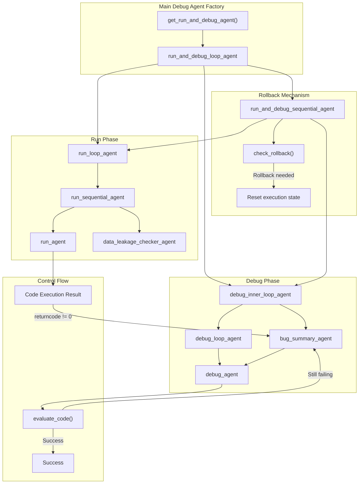
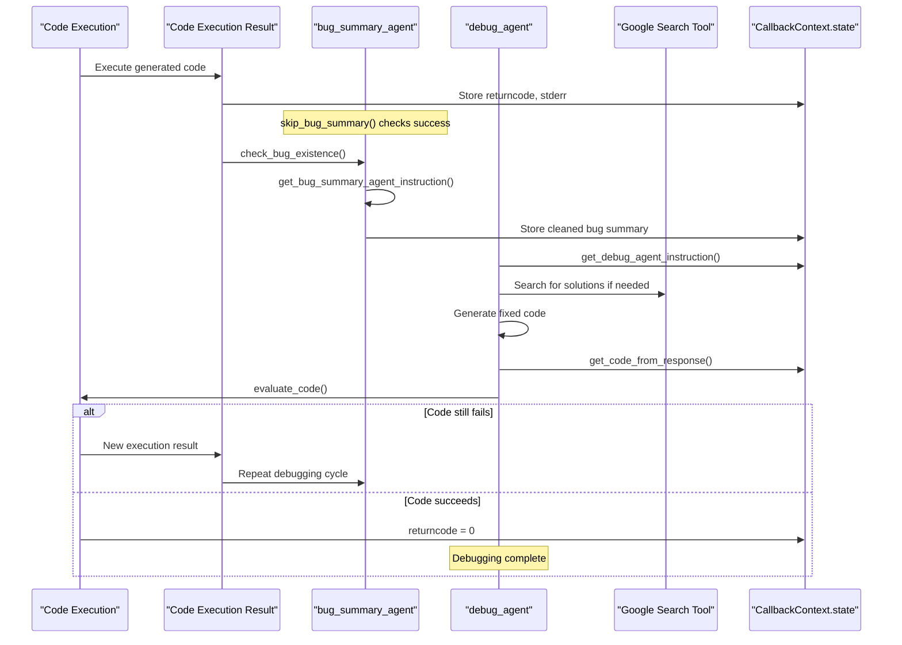
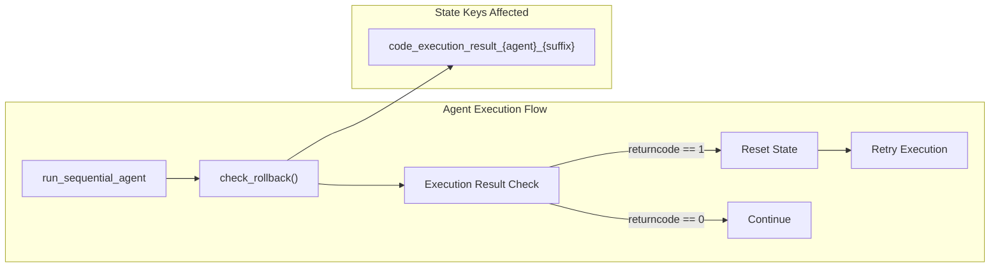

# Debugging System

Relevant source files

The following files were used as context for generating this wiki page:

- [machine_learning_engineering/shared_libraries/debug_prompt.py](machine_learning_engineering/shared_libraries/debug_prompt.py)
- [machine_learning_engineering/shared_libraries/debug_util.py](machine_learning_engineering/shared_libraries/debug_util.py)

## Purpose and Scope

The debugging system provides automated error detection, analysis, and code refinement capabilities for the MLE-STAR agent pipeline. It handles failures in generated machine learning code by summarizing errors, fixing bugs, and iteratively refining solutions until successful execution. The system integrates closely with the code execution system (see [Code Execution System](#4.2)) and supports various agent types throughout the pipeline.

The debugging system operates through a hierarchical structure of specialized agents that work together to identify, summarize, and resolve errors in generated Python code. It supports rollback mechanisms and integrates with data leakage checking when configured.

## System Architecture

### Debug Agent Hierarchy

Sources: [machine_learning_engineering/shared_libraries/debug_util.py:277-366]()

### Bug Processing Pipeline

Sources: [machine_learning_engineering/shared_libraries/debug_util.py:57-95](), [machine_learning_engineering/shared_libraries/debug_util.py:204-274]()

## Bug Detection and Summarization

### Bug Summary Agent

The bug summary agent processes execution errors and creates cleaned summaries for the debug agent. It operates through several key functions:

- **`skip_bug_summary()`** [debug_util.py:57-78]() - Bypasses bug summarization when code executes successfully (`returncode == 0`)
- **`check_bug_existence()`** [debug_util.py:81-95]() - Returns empty response if no bugs exist, preventing unnecessary debugging cycles
- **`get_bug_summary()`** [debug_util.py:39-54]() - Extracts and cleans bug reports, removing markdown formatting

### Agent-Specific Filename Detection

The system determines appropriate filenames for error context based on agent naming conventions:

| Agent Pattern | Filename Pattern | Purpose |
|---------------|------------------|---------|
| `model_eval_*` | `init_code_{model_id}.py` | Model evaluation debugging |
| `merger_*` | `train0_{reference_idx}.py` | Code merging operations |
| `check_data_use_*` | `train0.py` | Data usage validation |
| `ablation_*` | `ablation_{step}.py` | Ablation study execution |
| `plan_implement_*` | `train{step}_improve{inner_iter}.py` | Implementation refinement |
| `ensemble_plan_implement_*` | `ensemble{suffix}.py` | Ensemble implementation |
| `submission_*` | `final_solution.py` | Final submission preparation |

Sources: [machine_learning_engineering/shared_libraries/debug_util.py:98-136]()

### Bug Summary Instruction Template

The system uses structured prompts defined in `BUG_SUMMARY_INSTR` [debug_prompt.py:3-8]() that:
- Present the complete error report
- Request removal of unnecessary information  
- Preserve error location context
- Include the current filename being debugged

## Code Refinement Process

### Debug Agent Instructions

The debug agent receives comprehensive instructions through `BUG_REFINE_INSTR` [debug_prompt.py:10-29]() that specify:

- **Task Context**: Original task description for maintaining solution intent
- **Error Information**: Cleaned bug summary and original code
- **Refinement Guidelines**: 
  - Fix identified errors
  - Handle module installation via `pip install`
  - Preserve existing subsampling logic
  - Maintain self-contained Python script structure
  - Include performance parsing markers
  - Avoid `exit()` function usage

### Code Extraction and State Management

The `get_code_from_response()` function [debug_util.py:165-201]() handles:

- **Code Cleaning**: Removes markdown formatting from LLM responses
- **Agent-Specific Processing**: 
  - `check_data_use_*` agents: Monitors completion flags
  - `plan_implement_*` agents: Manages code block replacement
- **State Updates**: Stores refined code in agent-specific state keys
- **Automatic Evaluation**: Triggers code execution unless disabled

Sources: [machine_learning_engineering/shared_libraries/debug_util.py:139-162](), [machine_learning_engineering/shared_libraries/debug_util.py:165-201]()

## Agent Configuration and Control Flow

### Debug Loop Configuration

The debugging system uses configurable iteration limits:

- **`max_debug_round`**: Maximum iterations for individual debug cycles [debug_util.py:259](), [debug_util.py:272]()
- **`max_retry`**: Maximum retry attempts for run loops [debug_util.py:337]()  
- **`max_rollback_round`**: Maximum rollback iterations [debug_util.py:364]()

### Temperature Settings

Debug agents use different temperature settings for various behaviors:

- **Bug Summary Agent**: `temperature=0.0` for consistent error analysis [debug_util.py:227]()
- **Debug Agent**: `temperature=1.0` for creative problem-solving [debug_util.py:247]()
- **Run Agent**: `temperature=1.0` for solution generation [debug_util.py:304]()

### Integration with Data Leakage Checking

The `get_run_and_debug_agent()` function [debug_util.py:277-366]() conditionally integrates data leakage checking:

- **Ensemble agents**: Disable data leakage checking (`ensemble_plan_implement_*` prefix)
- **Other agents**: Enable checking based on `use_data_leakage_checker` configuration
- **Sequential execution**: Run agent followed by leakage checker when enabled

Sources: [machine_learning_engineering/shared_libraries/debug_util.py:285-317]()

## Rollback Mechanism

### State Management and Rollback

The `check_rollback()` function [debug_util.py:20-36]() provides failure recovery:

- **Execution Monitoring**: Checks `returncode` from code execution results
- **State Reset**: Clears execution result state when rollback is needed (`returncode == 1`)
- **Agent Exclusion**: Skips rollback for `ablation_*` agents
- **Automatic Triggering**: Executes as `after_agent_callback` in sequential agents

### Rollback Integration Points

Sources: [machine_learning_engineering/shared_libraries/debug_util.py:20-36](), [machine_learning_engineering/shared_libraries/debug_util.py:354]()

## Tool Integration

### Google Search Integration

Debug agents have access to the `google_search` tool [debug_util.py:243]() for:
- Researching error solutions
- Finding documentation for unfamiliar modules
- Identifying best practices for specific ML problems

### State Key Conventions

The debugging system follows consistent state key naming patterns:

- **Bug summaries**: `bug_summary_{prefix}_{suffix}`
- **Code storage**: Uses `get_code_state_key()` from code utilities
- **Execution results**: Uses `get_code_execution_result_state_key()` from code utilities

Sources: [machine_learning_engineering/shared_libraries/debug_util.py:48-53](), [machine_learning_engineering/shared_libraries/debug_util.py:175-178]()