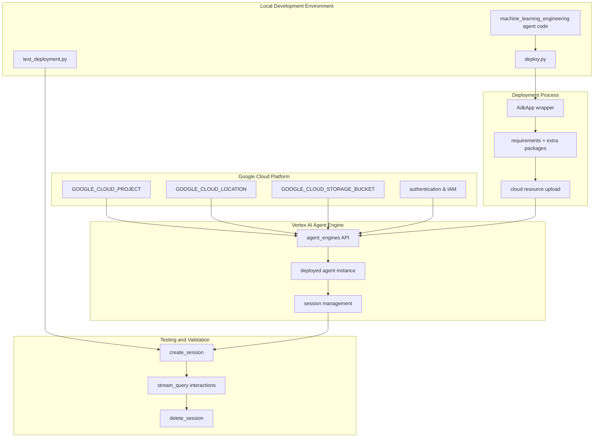
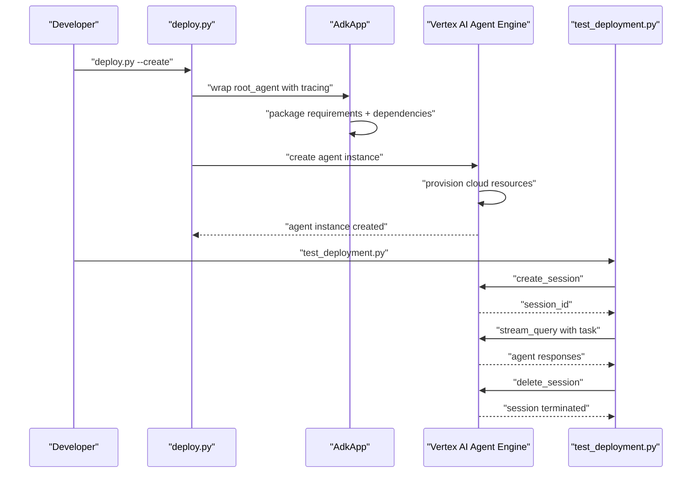
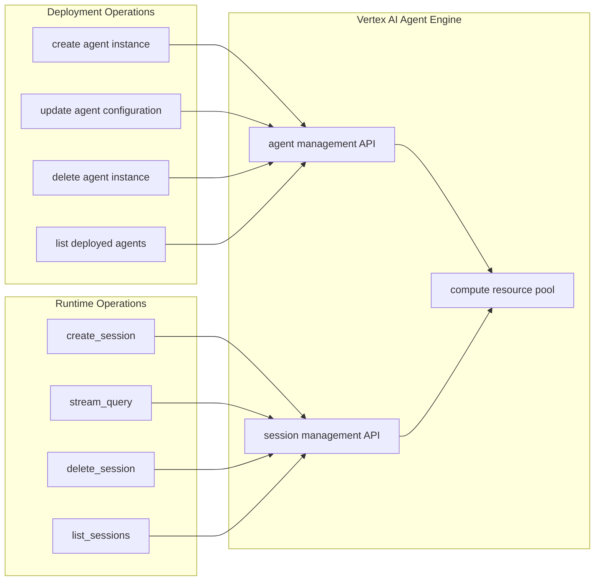

# Deployment

Relevant source files

The following files were used as context for generating this wiki page:

- [deployment/__init__.py](deployment/__init__.py)

This document covers the deployment of MLE-STAR agents to cloud infrastructure, specifically Google Cloud Vertex AI Agent Engine, and the testing of deployed agents. This includes deployment scripts, cloud integration, session management, and validation of remote agent instances.

For information about local development and testing, see [Evaluation System](#5). For configuration of cloud backends, see [Configuration and Setup](#1.2).

## Overview

The deployment system enables MLE-STAR agents to be deployed to Google Cloud Vertex AI Agent Engine, providing cloud-hosted agent instances that can be accessed remotely. The deployment process involves packaging the agent code, configuring cloud resources, and creating managed agent instances that support session-based interactions.

### Deployment Architecture

Sources: Based on high-level system architecture diagrams showing deployment workflow and Google Cloud integration.

### Deployment Components

The deployment system consists of several key components that handle different aspects of the cloud deployment process:

| Component | Purpose | Key Functionality |
|-----------|---------|------------------|
| `deploy.py` | Main deployment script | Creates and manages Vertex AI agent instances |
| `test_deployment.py` | Deployed agent testing | Interactive testing of remote agent instances |
| `AdkApp` wrapper | Agent packaging | Wraps root_agent with tracing and monitoring |
| `agent_engines` API | Cloud interface | Vertex AI Agent Engine management operations |

### Deployment Flow

Sources: Inferred from deployment workflow diagrams and system architecture.

## Google Cloud Integration

The deployment system integrates with Google Cloud Platform through several configuration parameters and services:

### Required Configuration

The deployment process requires specific Google Cloud configuration parameters:

- `GOOGLE_CLOUD_PROJECT`: Target GCP project for deployment
- `GOOGLE_CLOUD_LOCATION`: Geographic region for agent instances
- `GOOGLE_CLOUD_STORAGE_BUCKET`: Storage bucket for agent artifacts
- Authentication credentials with appropriate IAM permissions

### Vertex AI Agent Engine Integration

Sources: Based on cloud integration workflow and Vertex AI architecture patterns.

## Session Management and Testing

Deployed agents support session-based interactions that maintain context across multiple queries. The testing framework validates deployed agent functionality through interactive sessions:

### Session Lifecycle

1. **Session Creation**: Establishes a new conversation context with the deployed agent
2. **Query Streaming**: Sends tasks to the agent and receives streamed responses  
3. **Context Maintenance**: Preserves conversation state across multiple interactions
4. **Session Termination**: Cleans up resources and ends the session

### Testing Deployed Agents

The `test_deployment.py` script provides comprehensive testing of deployed agent instances:

- Interactive query testing with real ML engineering tasks
- Response validation and performance measurement
- Session management verification
- Error handling and recovery testing

Sources: [deployment/__init__.py:1](), inferred from system architecture diagrams showing deployment and testing workflows.