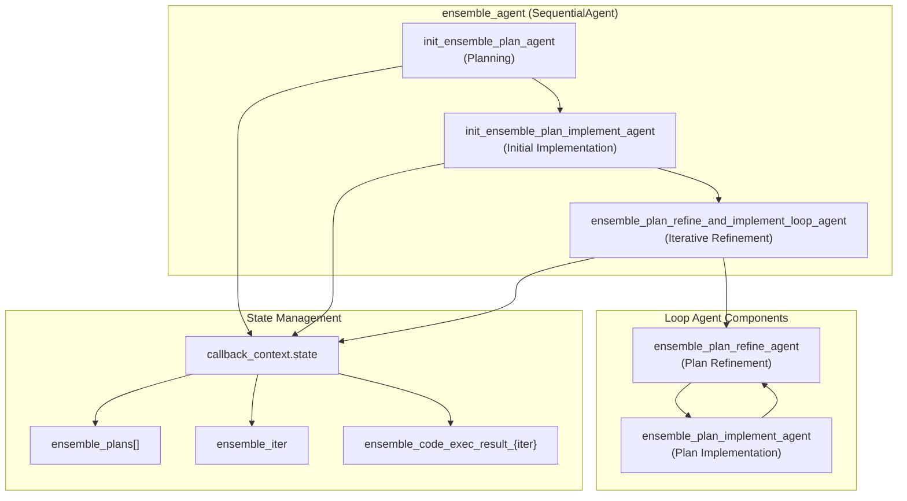
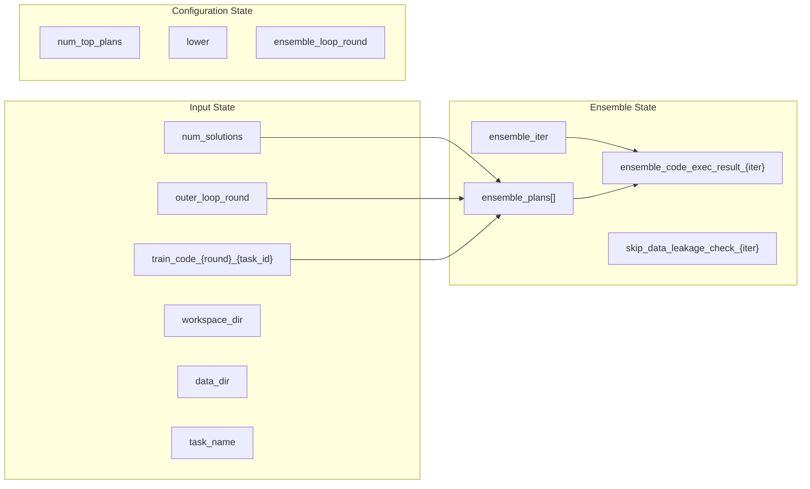
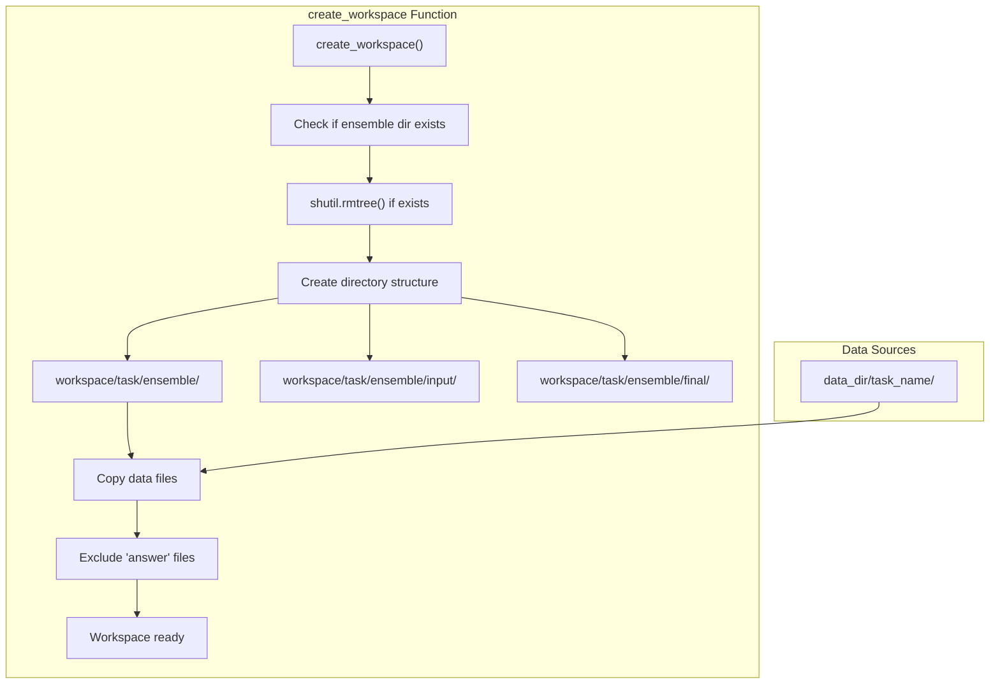
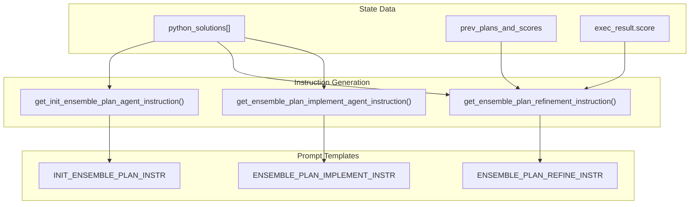
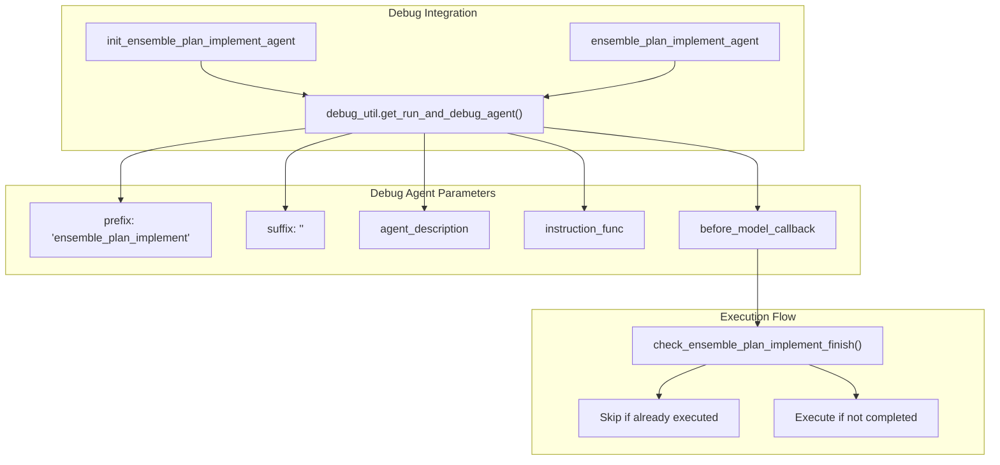

# Ensemble Agent

<details>
<summary>Relevant source files</summary>

The following files were used as context for generating this wiki page:

- [machine_learning_engineering/sub_agents/ensemble/agent.py](machine_learning_engineering/sub_agents/ensemble/agent.py)
- [machine_learning_engineering/sub_agents/ensemble/prompt.py](machine_learning_engineering/sub_agents/ensemble/prompt.py)

</details>


## Purpose and Scope

The Ensemble Agent is a specialized sub-agent within the MLE-STAR system responsible for combining multiple machine learning solutions to achieve better performance through ensemble techniques. This agent operates on refined solutions from the refinement phase and creates ensembled predictions by implementing various combination strategies.

For information about the overall agent pipeline workflow, see [Agent Pipeline](#2.1). For details about other specialized agents, see [Sub-Agents](#3).

## Agent Architecture

The `ensemble_agent` is implemented as a `SequentialAgent` that orchestrates multiple sub-agents in a specific order to plan, implement, and iteratively refine ensemble strategies.

### Core Agent Structure



Sources: [machine_learning_engineering/sub_agents/ensemble/agent.py:189-252]()

### Agent Configuration and Dependencies

| Agent Component | Type | Model | Temperature | Description |
|----------------|------|-------|-------------|-------------|
| `init_ensemble_plan_agent` | `Agent` | `config.CONFIG.agent_model` | 1.0 | Generates initial ensemble strategy |
| `init_ensemble_plan_implement_agent` | Debug Agent | Variable | Variable | Implements initial ensemble plan |
| `ensemble_plan_refine_agent` | `Agent` | `config.CONFIG.agent_model` | 1.0 | Refines ensemble strategy based on scores |
| `ensemble_plan_implement_agent` | Debug Agent | Variable | Variable | Implements refined ensemble plans |

Sources: [machine_learning_engineering/sub_agents/ensemble/agent.py:189-225]()

## State Management and Data Flow

The Ensemble Agent manages state through the `callback_context.state` dictionary to coordinate between planning and implementation phases.

### State Variables



Sources: [machine_learning_engineering/sub_agents/ensemble/agent.py:20-33](), [machine_learning_engineering/sub_agents/ensemble/agent.py:76-93]()

### State Lifecycle Functions

| Function | Purpose | State Variables Modified |
|----------|---------|-------------------------|
| `init_ensemble_loop_states` | Initialize loop iteration counter | `ensemble_iter = 0` |
| `update_ensemble_loop_states` | Increment loop iteration counter | `ensemble_iter += 1` |
| `get_init_ensemble_plan` | Store initial ensemble plan | `ensemble_plans = [response_text]` |
| `get_refined_ensemble_plan` | Append refined plan | `ensemble_plans.append(response_text)` |
| `check_ensemble_plan_implement_finish` | Check if implementation completed | `skip_data_leakage_check_{iter}` |

Sources: [machine_learning_engineering/sub_agents/ensemble/agent.py:20-73]()

## Workspace Management

The Ensemble Agent creates a dedicated workspace structure for ensemble operations, separating input data from final outputs.

### Workspace Creation Process



Sources: [machine_learning_engineering/sub_agents/ensemble/agent.py:158-186]()

## Instruction Generation

The Ensemble Agent uses dynamic instruction generation to provide context-specific prompts based on current state and available solutions.

### Instruction Functions



Sources: [machine_learning_engineering/sub_agents/ensemble/agent.py:76-155](), [machine_learning_engineering/sub_agents/ensemble/prompt.py:1-66]()

### Score-Based Plan Refinement

The `get_ensemble_plan_refinement_instruction` function implements a sophisticated scoring system to guide plan improvement:

| Parameter | Purpose | Default Value |
|-----------|---------|---------------|
| `num_top_plans` | Number of top performing plans to analyze | 3 |
| `lower` | Whether lower scores are better | `True` |
| `criteria` | Scoring criteria ("lower" or "higher") | Based on `lower` flag |

The function uses `numpy.argsort()` to rank previous plans by performance and selects the best performers for analysis.

Sources: [machine_learning_engineering/sub_agents/ensemble/agent.py:96-134]()

## Integration with Debugging System

The Ensemble Agent leverages the shared debugging system for robust code execution and error handling during plan implementation.

### Debug Agent Integration



Sources: [machine_learning_engineering/sub_agents/ensemble/agent.py:201-225]()

## Iterative Refinement Loop

The ensemble agent uses a `LoopAgent` to iteratively refine ensemble strategies based on performance feedback.

### Loop Configuration

| Component | Value | Purpose |
|-----------|--------|---------|
| `max_iterations` | `config.CONFIG.ensemble_loop_round` | Maximum refinement iterations |
| `before_agent_callback` | `update_ensemble_loop_states` | Increment iteration counter |
| `after_agent_callback` | `update_ensemble_loop_states` | Update state after each iteration |

### Loop Execution Flow

```mermaid
sequenceDiagram
    participant Loop as "ensemble_plan_refine_and_implement_loop_agent"
    participant Refine as "ensemble_plan_refine_agent"
    participant Implement as "ensemble_plan_implement_agent"
    participant State as "callback_context.state"
    
    Loop->>State: update_ensemble_loop_states()
    Loop->>Refine: Execute refinement
    Refine->>State: get_refined_ensemble_plan()
    Refine->>Implement: Pass to implementation
    Implement->>State: Store execution results
    Implement->>Loop: Complete iteration
    Loop->>State: update_ensemble_loop_states()
    
    Note over Loop: Repeat until max_iterations
```

Sources: [machine_learning_engineering/sub_agents/ensemble/agent.py:226-241]()