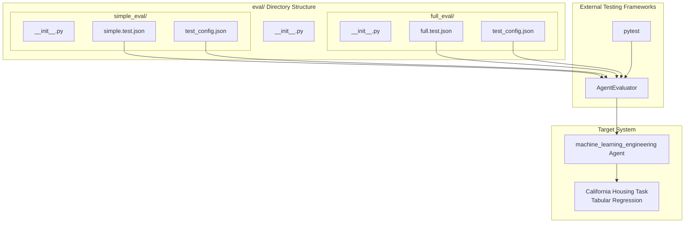
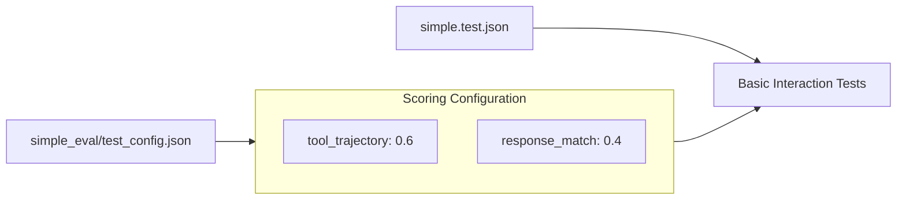
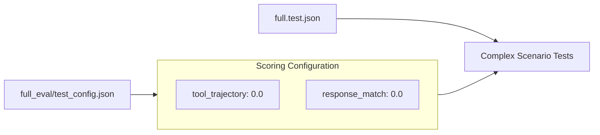
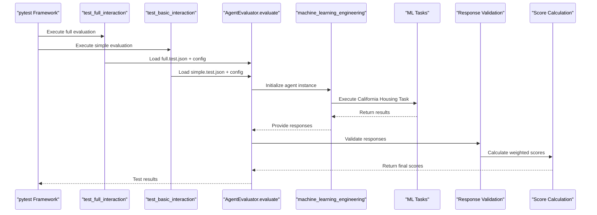
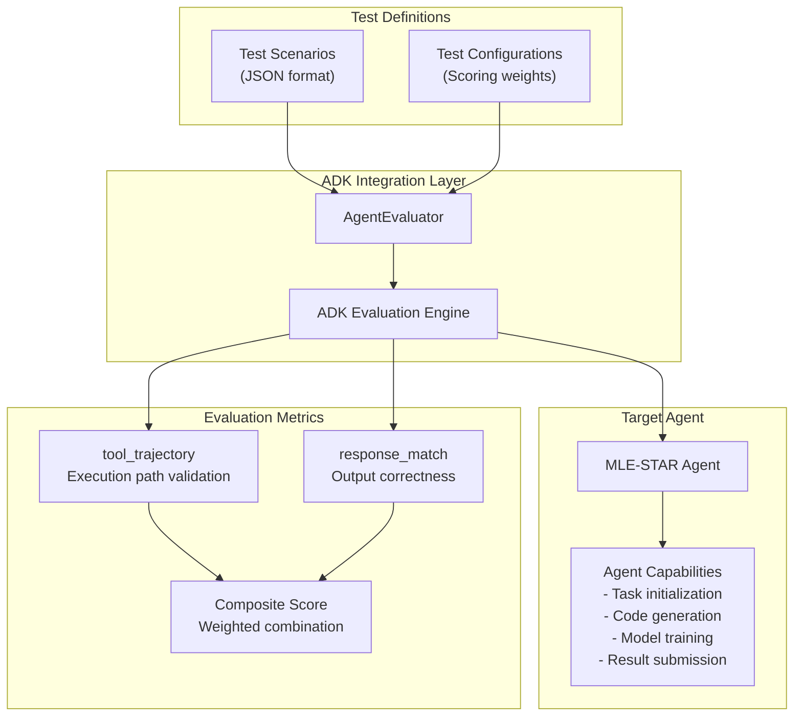

# Evaluation System

Relevant source files

The following files were used as context for generating this wiki page:

- [eval/__init__.py](eval/__init__.py)
- [eval/full_eval/__init__.py](eval/full_eval/__init__.py)
- [eval/simple_eval/__init__.py](eval/simple_eval/__init__.py)

## Purpose and Scope

The Evaluation System provides a comprehensive testing framework for validating the capabilities and performance of the MLE-STAR machine learning engineering agent. It implements a two-tier testing approach with basic and comprehensive evaluation scenarios, integrated with Google's Agent Development Kit (ADK) evaluation framework.

This document covers the overall evaluation architecture, test execution flow, and scoring mechanisms. For detailed test implementation and pytest integration, see [Test Framework](#5.1). For specific test scenarios and configuration details, see [Test Cases and Configuration](#5.2).

## Evaluation Architecture

The evaluation system is structured around two primary evaluation tiers, each designed to test different aspects of agent functionality:

Sources: [eval/__init__.py:1](), [eval/full_eval/__init__.py:1](), [eval/simple_eval/__init__.py:1]()

## Two-Tier Evaluation Approach

The system implements distinct evaluation tiers optimized for different testing scenarios:

| Evaluation Tier | Purpose | Test Complexity | Target Use Case |
|-----------------|---------|-----------------|-----------------|
| `simple_eval` | Basic functionality validation | Low complexity interactions | Smoke testing, quick validation |
| `full_eval` | Comprehensive capability testing | Complex multi-step scenarios | Thorough performance assessment |

### Simple Evaluation Configuration

The `simple_eval` tier focuses on basic agent interactions with weighted scoring:

### Full Evaluation Configuration  

The `full_eval` tier emphasizes comprehensive testing with different scoring priorities:

Sources: Based on diagram analysis of evaluation system architecture

## Test Execution Flow

The evaluation system integrates with both pytest and Google ADK to provide comprehensive test execution:

Sources: Based on diagram analysis of evaluation pipeline

## Integration with Google ADK

The evaluation system leverages Google's Agent Development Kit (ADK) `AgentEvaluator` class for standardized agent testing:

Sources: Based on diagram analysis of evaluation system integration

## Scoring Configuration

The evaluation system uses weighted scoring mechanisms that differ between evaluation tiers:

| Metric | Simple Eval Weight | Full Eval Weight | Description |
|--------|-------------------|------------------|-------------|
| `tool_trajectory` | 0.6 | 0.0 | Validates the sequence of tools/actions used |
| `response_match` | 0.4 | 0.0 | Measures correctness of final responses |

### Simple Evaluation Scoring

The `simple_eval` configuration emphasizes tool usage patterns and response accuracy, making it suitable for validating basic agent functionality and interaction flows.

### Full Evaluation Scoring  

The `full_eval` configuration uses zero weights for standard metrics, suggesting it may employ custom evaluation criteria or focus on qualitative assessment of complex scenarios.

Sources: Based on diagram analysis of test configuration systems