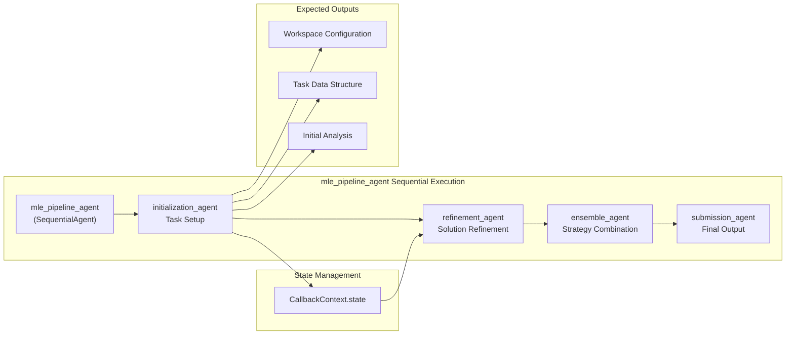
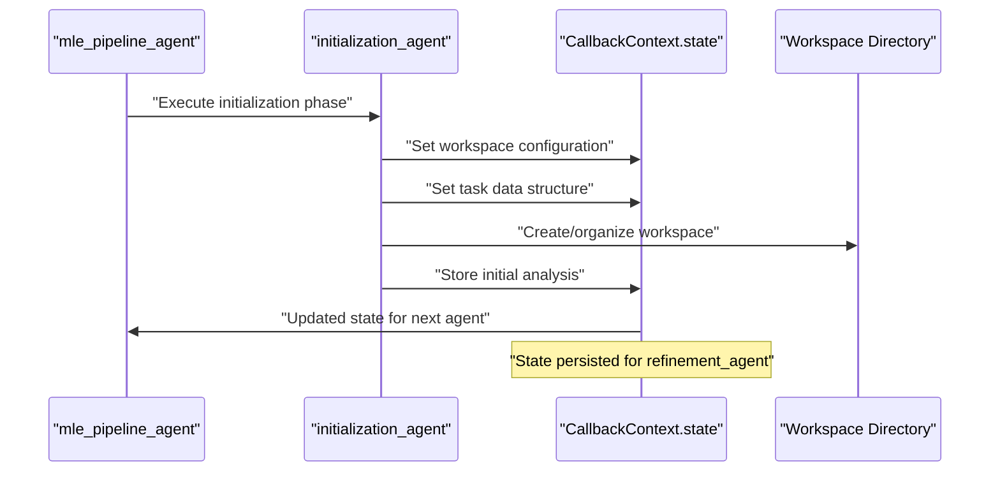
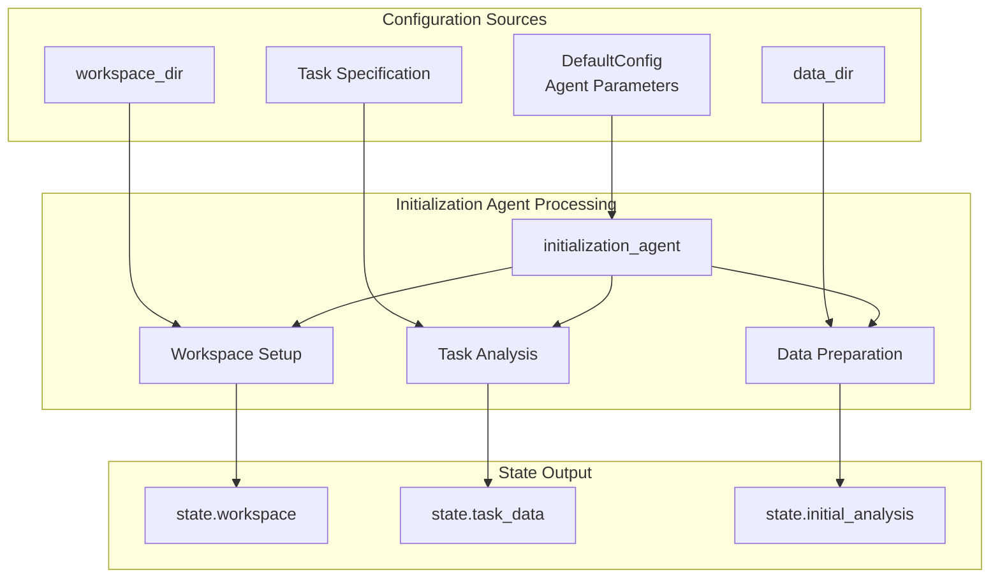

# Initialization Agent

<details>
<summary>Relevant source files</summary>

The following files were used as context for generating this wiki page:

- [machine_learning_engineering/sub_agents/initialization/__init__.py](machine_learning_engineering/sub_agents/initialization/__init__.py)

</details>


## Purpose and Scope

The Initialization Agent is the first component in the MLE-STAR sequential agent pipeline, responsible for setting up the machine learning task environment and preparing the foundational workspace for subsequent agents. This document covers the architectural role, integration patterns, and expected functionality of the initialization agent within the broader multi-agent system.

For information about the overall agent pipeline execution flow, see [Agent Pipeline](#2.1). For details about other specialized agents in the pipeline, see [Sub-Agents](#3).

## Role in the Agent Pipeline

The Initialization Agent serves as the entry point for all machine learning engineering tasks within the MLE-STAR system. It operates as the first stage in a sequential processing pipeline that follows the pattern: initialization → refinement → ensemble → submission.

### Sequential Pipeline Position



Sources: Architecture diagrams from system overview, agent pipeline flow documentation

### Integration with State Management

The Initialization Agent is responsible for populating the shared state that subsequent agents rely upon. This state management integration ensures continuity across the sequential pipeline.



Sources: Sequential agent execution patterns, state management architecture

## Architecture and Integration

### Code Organization

The Initialization Agent follows the sub-agent organizational pattern within the MLE-STAR codebase:

| Component | File Path | Purpose |
|-----------|-----------|---------|
| Package Definition | `machine_learning_engineering/sub_agents/initialization/__init__.py` | Module initialization |

The agent integrates with the broader system through the sequential agent execution framework managed by `mle_pipeline_agent`.

### Configuration Integration



Sources: Configuration management system, agent parameter handling

## Expected Functionality

Based on the system architecture and sequential pipeline design, the Initialization Agent is expected to perform several key functions:

### Task Analysis and Setup

The agent should analyze the incoming machine learning task specification and establish the foundational understanding that guides subsequent processing stages.

### Workspace Configuration

Creation and organization of the workspace directory structure to support code execution, data processing, and intermediate result storage throughout the pipeline.

### Data Environment Preparation

Initial data loading, validation, and preparation activities that establish the data context for machine learning model development.

### State Initialization

Population of the shared state structure with essential task metadata, workspace configuration, and initial analysis results that subsequent agents in the pipeline require.

## Current Implementation Status

### Package Structure

The initialization agent currently exists as a package within the sub-agents directory structure:

```mermaid
graph TD
    subgraph "Sub-Agents Directory Structure"
        SubAgents["machine_learning_engineering/sub_agents/"]
        InitPackage["initialization/"]
        InitFile["__init__.py"]
    end
    
    SubAgents --> InitPackage
    InitPackage --> InitFile
    
    Note over InitFile: "Currently minimal implementation"
```

The package follows the standard Python module organization but contains minimal implementation details in the current codebase version.

### Integration Points

While the implementation details are minimal, the architectural integration points are established through:

- Sequential agent execution framework
- State management system integration  
- Configuration parameter handling
- Workspace and data directory management

Sources: [machine_learning_engineering/sub_agents/initialization/__init__.py:1-1]()

## Summary

The Initialization Agent represents a critical architectural component in the MLE-STAR system, serving as the foundation for the sequential agent pipeline. While the current implementation is minimal, the agent's role in task setup, workspace configuration, and state initialization is well-defined within the system architecture. Future development of this component should focus on implementing the expected functionality for task analysis, workspace management, and data preparation to fully support the downstream agent processing pipeline.