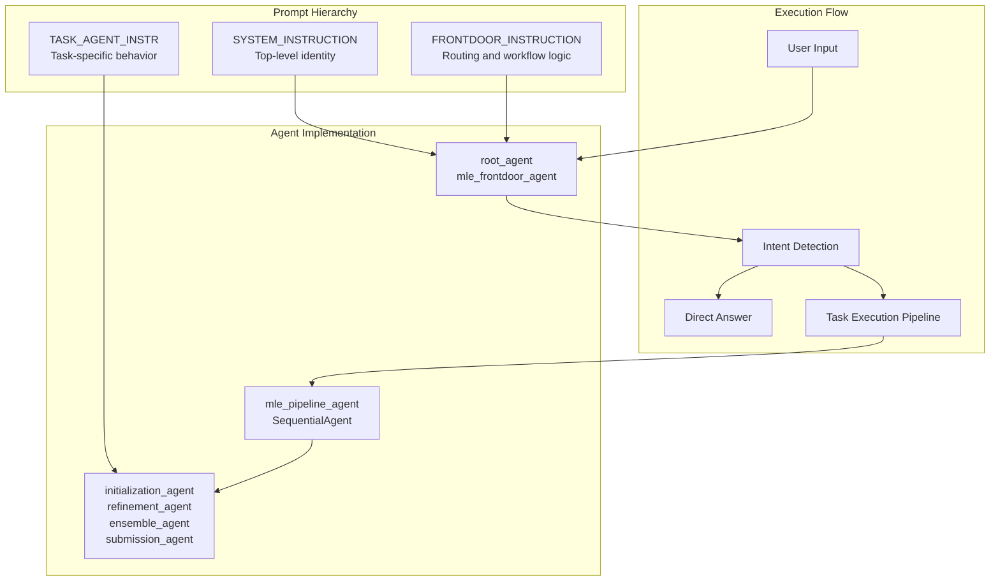
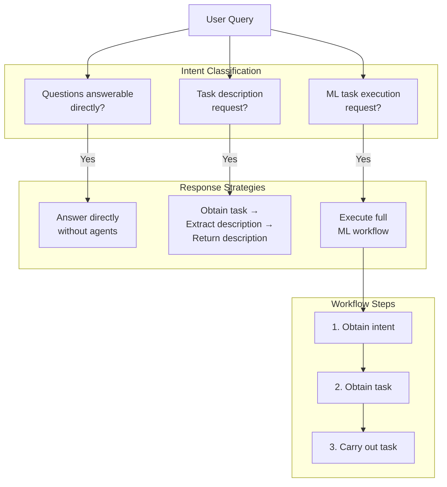
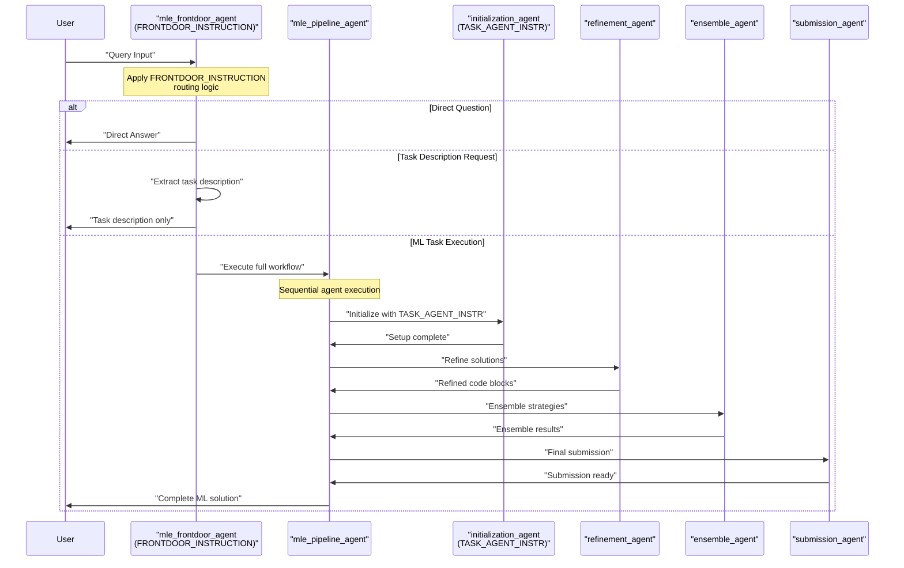

# Instructions and Prompts

Relevant source files

The following files were used as context for generating this wiki page:

- [machine_learning_engineering/prompt.py](machine_learning_engineering/prompt.py)

This document covers the system instructions and prompts that define the behavior and decision-making logic of the MLE-STAR agent system. These prompts serve as the foundational behavioral guidelines that control how agents interpret tasks, route requests, and execute machine learning workflows.

For information about the agent execution pipeline and state management, see [Agent Pipeline](#2.1). For details about specific agent implementations, see [Sub-Agents](#3).

## Prompt Architecture Overview

The MLE-STAR system uses a hierarchical prompt structure to define agent behavior at different levels of the system. The prompts establish clear boundaries between direct question answering and complex ML task execution.

**Sources:** [machine_learning_engineering/prompt.py:1-34]()

## System Instruction Definition

The `SYSTEM_INSTRUCTION` provides the foundational identity for all agents in the system. It establishes the agent as a "Machine Learning Engineering Multi Agent System," setting the context for all subsequent interactions.

| Prompt Component | Purpose | Implementation |
|------------------|---------|----------------|
| `SYSTEM_INSTRUCTION` | Agent identity and role definition | Applied to `root_agent` initialization |
| Scope | High-level system behavior | Multi-agent coordination context |

This instruction serves as the base behavioral foundation that informs all agent decisions and ensures consistent identity across the distributed agent system.

**Sources:** [machine_learning_engineering/prompt.py:4-5]()

## Frontdoor Instruction Behavior

The `FRONTDOOR_INSTRUCTION` defines the core routing and decision-making logic for the `mle_frontdoor_agent`. This instruction establishes a clear workflow for handling different types of user requests.

### Decision Tree Logic

### Behavioral Rules

The frontdoor instruction establishes three primary behavioral patterns:

1. **Direct Answering**: Questions that can be answered immediately without invoking additional agents
2. **Task Description**: Requests for task information that require task retrieval but not execution
3. **Task Execution**: Full machine learning workflows that require the complete agent pipeline

**Sources:** [machine_learning_engineering/prompt.py:7-26]()

## Task Agent Instructions

The `TASK_AGENT_INSTR` defines behavior for agents that handle specific ML tasks within the pipeline. These instructions establish the competitive mindset and technical approach for ML problem solving.

### Competitive Framework

| Instruction Element | Purpose | Implementation Context |
|-------------------|---------|----------------------|
| Kaggle Grandmaster Role | Competitive excellence mindset | Applied to task-specific agents |
| Python Solution Requirement | Technical constraint | Code generation and execution |
| Data Path Acquisition | Setup prerequisite | Initial task configuration |

The instruction emphasizes a competitive approach to ML engineering, requiring agents to:
- Adopt a Kaggle grandmaster mindset for solution quality
- Generate Python-based solutions exclusively  
- Establish proper data access before beginning work

**Sources:** [machine_learning_engineering/prompt.py:29-33]()

## Prompt Integration with Agent Pipeline

The prompt system integrates directly with the agent execution pipeline, providing behavioral guidance at each stage of the ML workflow.

### Prompt-Agent Mapping

| Prompt | Target Agent | Behavioral Focus |
|--------|-------------|------------------|
| `SYSTEM_INSTRUCTION` | All agents | System identity |
| `FRONTDOOR_INSTRUCTION` | `mle_frontdoor_agent` | Request routing and workflow initiation |
| `TASK_AGENT_INSTR` | Task-specific agents | ML engineering approach and quality standards |

**Sources:** [machine_learning_engineering/prompt.py:1-34]()

## Tool Usage and Scope Definition

The frontdoor instruction explicitly defines tool usage patterns and scope boundaries for different types of interactions.

### Scope Categories

1. **Greeting/Out of Scope**: Handle directly without additional agent invocation
2. **Task Information**: Retrieve and extract without full execution
3. **ML Workflow**: Full pipeline execution with all specialized agents

This scope definition ensures efficient resource utilization and appropriate response strategies based on user intent classification.

**Sources:** [machine_learning_engineering/prompt.py:23-26]()