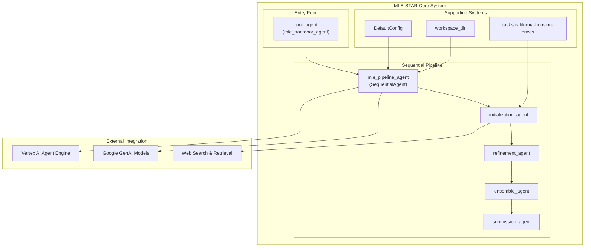
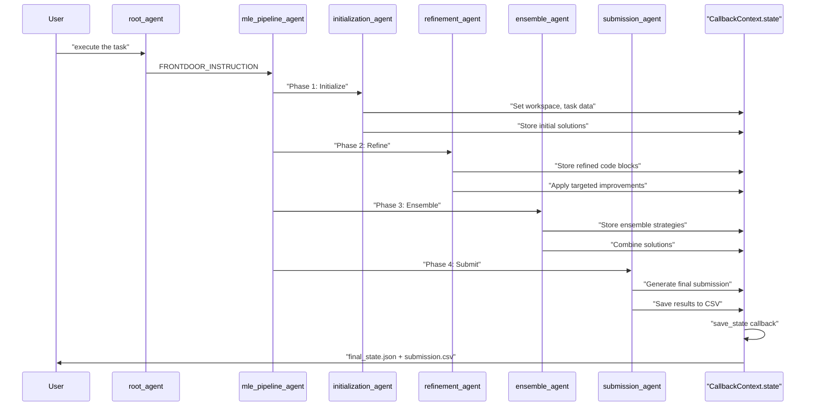
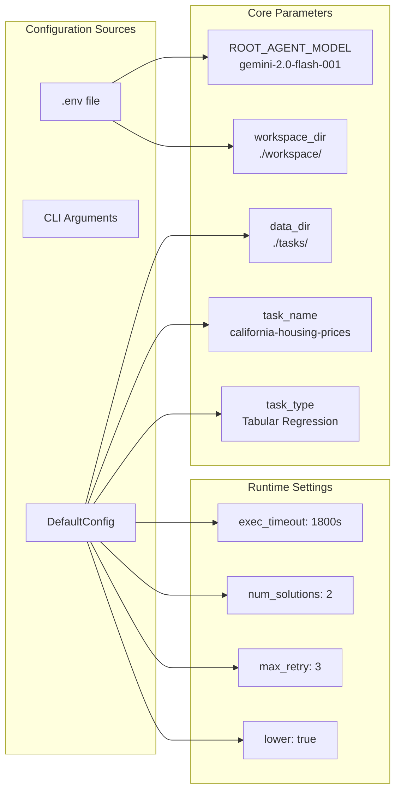
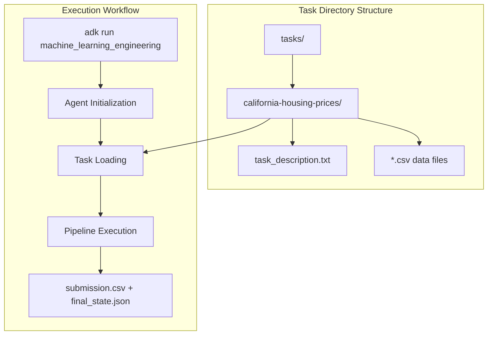

# Overview

Relevant source files

The following files were used as context for generating this wiki page:

- [README.md](README.md)
- [machine-learning-engineering-architecture.svg](machine-learning-engineering-architecture.svg)
- [machine_learning_engineering/__init__.py](machine_learning_engineering/__init__.py)

This document provides a technical overview of the MLE-STAR (Machine Learning Engineering with Multiple Agents) system, a sophisticated multi-agent framework designed to automate the implementation of state-of-the-art machine learning models. The system leverages web search, targeted code refinement, and ensemble strategies to achieve competitive performance on machine learning tasks, demonstrating medal-winning results on 63.6% of Kaggle competitions in the MLE-bench-Lite benchmark.

For detailed information about individual agents and their implementations, see [Sub-Agents](#3). For configuration management and deployment procedures, see [Configuration and Setup](#1.2) and [Deployment](#6).

## System Purpose and Architecture

MLE-STAR is a conversational, multi-agent system that automates the end-to-end machine learning engineering process. The system follows a sequential agent architecture where specialized agents handle different phases of ML model development, from initial solution generation through final submission.

### High-Level Agent Architecture

Sources: [README.md:1-317](), [machine_learning_engineering/__init__.py:1-4]()

### Core Agent Execution Flow

The system implements a sophisticated state management approach where each agent in the pipeline builds upon the previous agent's results through a shared `CallbackContext.state`.

Sources: [README.md:17-44](), [README.md:167-190]()

## Key System Capabilities

### Initial Solution Generation
The system retrieves state-of-the-art models and example code through web search, then merges the best-performing candidates into a consolidated initial solution. This approach leverages existing ML knowledge and best practices from the broader community.

### Targeted Code Block Refinement
MLE-STAR implements an iterative improvement process that identifies specific code blocks (ML pipeline components) with the most significant performance impact through ablation studies. An inner refinement loop applies various optimization strategies to these targeted components.

### Ensemble Strategies
The system introduces novel ensembling methods where agents propose and refine ensemble strategies to combine multiple solutions, aiming for superior performance compared to individual best solutions.

### Robustness Modules
Three key robustness components ensure system reliability:
- **Debugging Agent**: Automated error correction and code refinement
- **Data Leakage Checker**: Prevents improper data access during preprocessing
- **Data Usage Checker**: Ensures all provided data sources are utilized effectively

Sources: [README.md:35-43]()

## Configuration and Backend Support

The system supports dual backend configurations for flexible deployment scenarios:

| Backend Type | Environment Variable | Authentication | Use Case |
|--------------|---------------------|----------------|----------|
| Vertex AI | `GOOGLE_GENAI_USE_VERTEXAI=true` | GCloud CLI | Production deployment |
| ML Dev API | `GOOGLE_GENAI_USE_VERTEXAI=false` | API Key | Development/testing |

### Configuration Parameters

Sources: [README.md:120-127](), [README.md:272-317]()

## Task Structure and Execution

The system expects a specific task structure for ML problems:

Sources: [README.md:137-190](), [README.md:278-296]()

The system demonstrates strong performance on tabular regression tasks, achieving competitive results through its multi-agent approach and sophisticated refinement strategies. The architecture enables both local development and cloud deployment, making it suitable for various ML engineering scenarios.