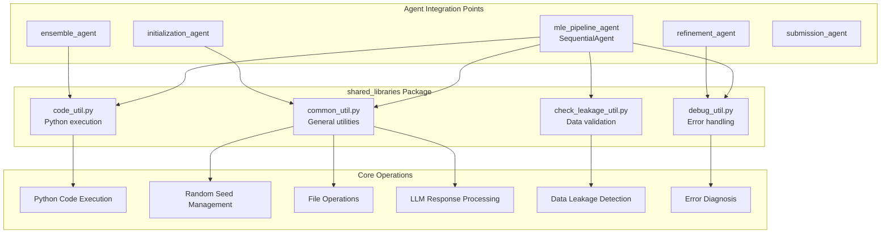
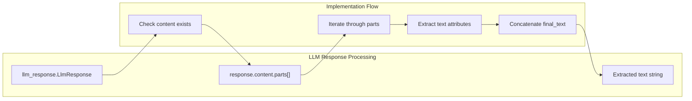
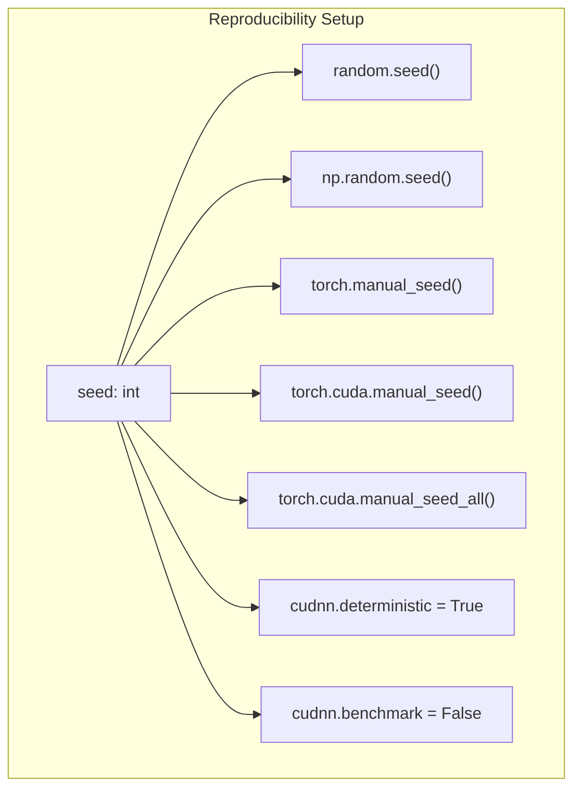
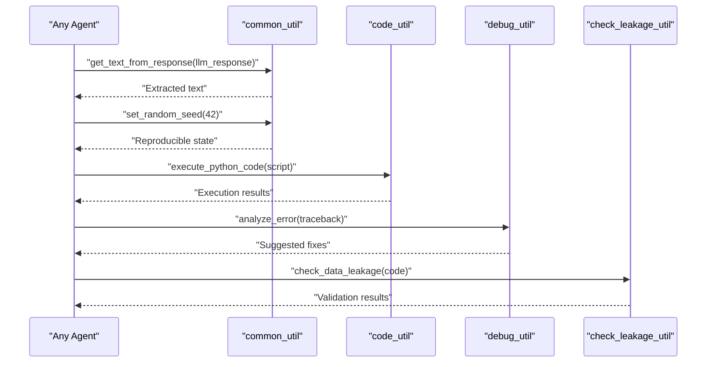

# Shared Libraries

Relevant source files

The following files were used as context for generating this wiki page:

- [machine_learning_engineering/shared_libraries/__init__.py](machine_learning_engineering/shared_libraries/__init__.py)
- [machine_learning_engineering/shared_libraries/common_util.py](machine_learning_engineering/shared_libraries/common_util.py)

## Purpose and Scope

The shared libraries provide common utilities and helper functions used across the MLE-STAR agent system. These libraries abstract away low-level operations for code execution, debugging, data validation, and general utility functions, enabling the agents to focus on high-level machine learning engineering tasks.

For configuration management details, see [Configuration Management](#4.1). For code execution capabilities, see [Code Execution System](#4.2). For debugging functionality, see [Debugging System](#4.3). For data validation utilities, see [Data Validation](#4.4).

## Library Structure and Organization

The shared libraries are organized in the `machine_learning_engineering/shared_libraries/` directory and provide specialized utility modules that support different aspects of the agent pipeline execution.

### Core Utility Modules

Sources: [machine_learning_engineering/shared_libraries/common_util.py:1-41]()

### Utility Function Categories

The shared libraries provide four main categories of functionality:

| Category | Module | Primary Functions | Agent Usage |
|----------|--------|------------------|-------------|
| General Utilities | `common_util.py` | Response processing, random seeding, file operations | All agents |
| Code Execution | `code_util.py` | Python script execution, performance extraction | Refinement, ensemble agents |
| Debug Support | `debug_util.py` | Error analysis, code refinement | Refinement agent |
| Data Validation | `check_leakage_util.py` | Data leakage detection, prevention | Initialization, refinement agents |

## Common Utility Functions

The `common_util` module provides fundamental utility functions used throughout the agent system.

### LLM Response Processing

The `get_text_from_response` function extracts text content from Google ADK LLM responses:

Sources: [machine_learning_engineering/shared_libraries/common_util.py:12-22]()

### Random Seed Management

The `set_random_seed` function ensures reproducible results across different libraries:

Sources: [machine_learning_engineering/shared_libraries/common_util.py:25-33]()

### File Operations

The `copy_file` function provides safe file copying with directory creation:

- Creates destination directories if they don't exist using `os.makedirs(exist_ok=True)`
- Uses `shutil.copy2` to preserve file metadata
- Supports copying files across different directory structures

Sources: [machine_learning_engineering/shared_libraries/common_util.py:36-40]()

## Integration with Agent System

The shared libraries are imported and used throughout the agent pipeline to provide consistent behavior and reduce code duplication:

Sources: [machine_learning_engineering/shared_libraries/common_util.py:1-41]()

The shared libraries form the foundation layer that enables the MLE-STAR agent system to perform complex machine learning engineering tasks while maintaining code quality, reproducibility, and robust error handling.