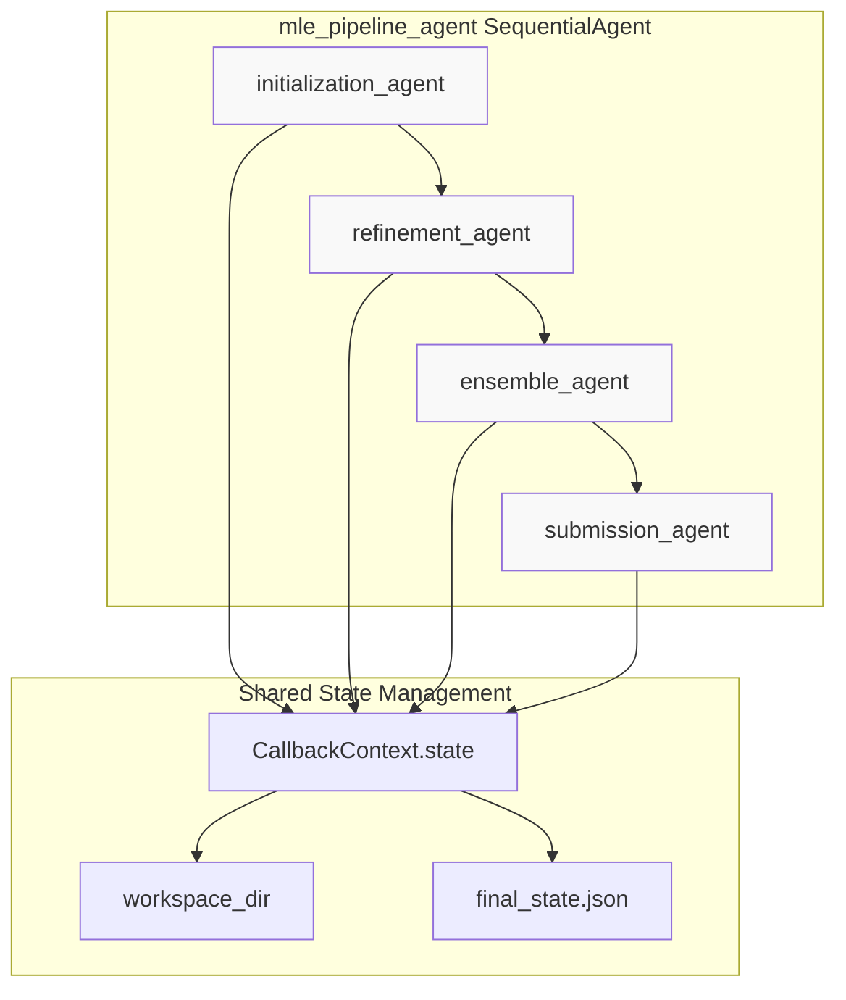
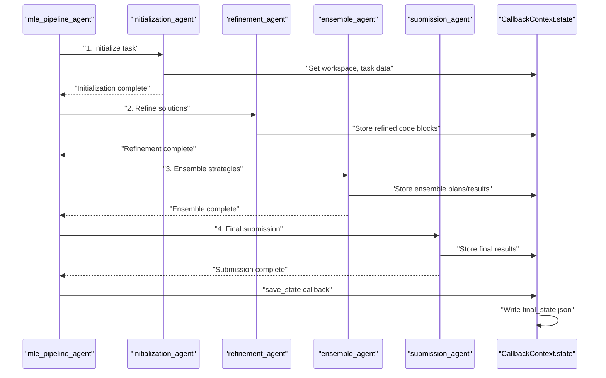
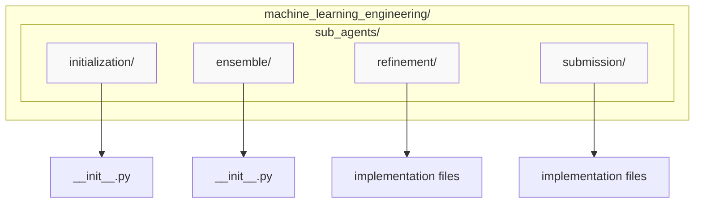
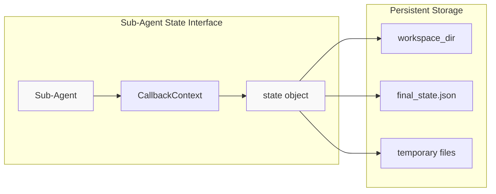

# Sub-Agents

Relevant source files

The following files were used as context for generating this wiki page:

- [machine_learning_engineering/sub_agents/ensemble/__init__.py](machine_learning_engineering/sub_agents/ensemble/__init__.py)
- [machine_learning_engineering/sub_agents/initialization/__init__.py](machine_learning_engineering/sub_agents/initialization/__init__.py)

## Purpose and Scope

This document provides an overview of the specialized sub-agents that comprise the MLE-STAR system's multi-agent pipeline for machine learning engineering tasks. Sub-agents are modular components that handle specific phases of the ML engineering workflow, from task initialization through final submission.

For detailed information about the overall agent pipeline execution flow, see [Agent Pipeline](#2.1). For implementation details of specific sub-agents, see [Ensemble Agent](#3.1) and [Initialization Agent](#3.2).

## Sub-Agent Architecture Overview

The MLE-STAR system implements a sequential multi-agent architecture where specialized sub-agents execute in a defined order, with each agent building upon the results of previous agents through shared state management.

### Sub-Agent Pipeline Structure

**Sources:** High-level system architecture diagrams, Agent execution flow sequence diagram

### Sub-Agent Execution Flow

**Sources:** Agent execution flow sequence diagram

## Sub-Agent Types and Responsibilities

The MLE-STAR system implements four primary sub-agents, each handling a distinct phase of the machine learning engineering workflow:

| Sub-Agent | Primary Function | Key Responsibilities |
|-----------|------------------|---------------------|
| `initialization_agent` | Task Setup | Workspace initialization, data loading, problem analysis |
| `refinement_agent` | Solution Development | Code generation, model training, iterative refinement |
| `ensemble_agent` | Model Combination | Ensemble strategy development, model combination |
| `submission_agent` | Final Output | Result compilation, submission preparation |

### Initialization Agent

The `initialization_agent` handles the initial setup phase of ML engineering tasks, including workspace preparation and problem analysis.

**Key Functions:**
- Workspace directory setup
- Task data loading and validation  
- Problem type identification
- Initial data exploration

**Sources:** [machine_learning_engineering/sub_agents/initialization/__init__.py:1]()

### Refinement Agent

The `refinement_agent` implements the core ML development workflow, generating and iteratively improving machine learning solutions.

**Key Functions:**
- Code generation for ML pipelines
- Model training and validation
- Performance optimization
- Error handling and debugging

### Ensemble Agent

The `ensemble_agent` develops strategies for combining multiple ML models to improve overall performance.

**Key Functions:**
- Ensemble strategy selection
- Model combination implementation
- Performance evaluation
- Final ensemble preparation

**Sources:** [machine_learning_engineering/sub_agents/ensemble/__init__.py:1]()

### Submission Agent

The `submission_agent` handles the final compilation and formatting of results for submission.

**Key Functions:**
- Result aggregation
- Output formatting
- Final validation
- Submission preparation

## Implementation Structure

### Sub-Agent Module Organization

The sub-agents are organized in a modular directory structure under the main package:

**Sources:** [machine_learning_engineering/sub_agents/initialization/__init__.py:1](), [machine_learning_engineering/sub_agents/ensemble/__init__.py:1]()

### State Management Integration

All sub-agents integrate with the shared state management system through `CallbackContext.state`, enabling seamless data flow between pipeline stages:

**Sources:** Agent execution flow sequence diagram, Overall system architecture

## Integration with Pipeline Agent

Sub-agents are executed by the `mle_pipeline_agent`, which implements the `SequentialAgent` pattern to orchestrate the multi-stage ML engineering workflow. The pipeline agent manages:

- Sequential execution order
- State passing between agents
- Error handling and recovery
- Progress tracking and logging

The pipeline ensures that each sub-agent receives the necessary context and state information from previous stages while maintaining isolation between different phases of the workflow.

**Sources:** High-level system architecture diagrams, Core Agent System documentation