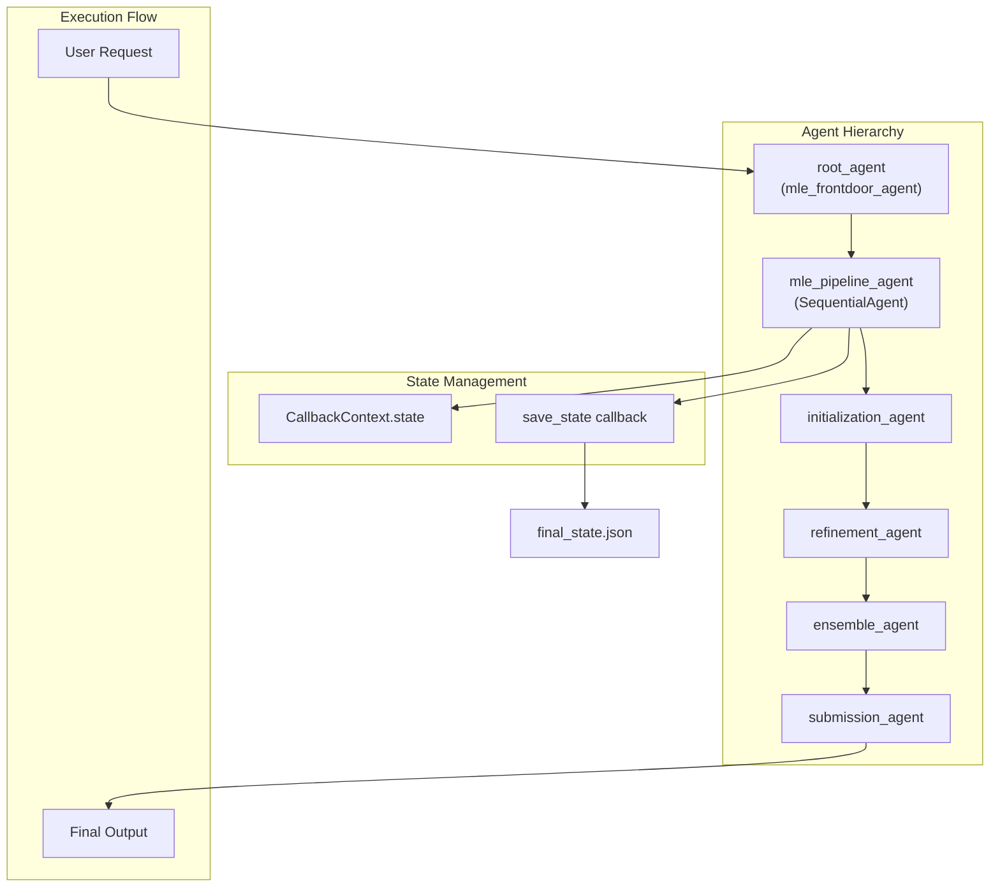
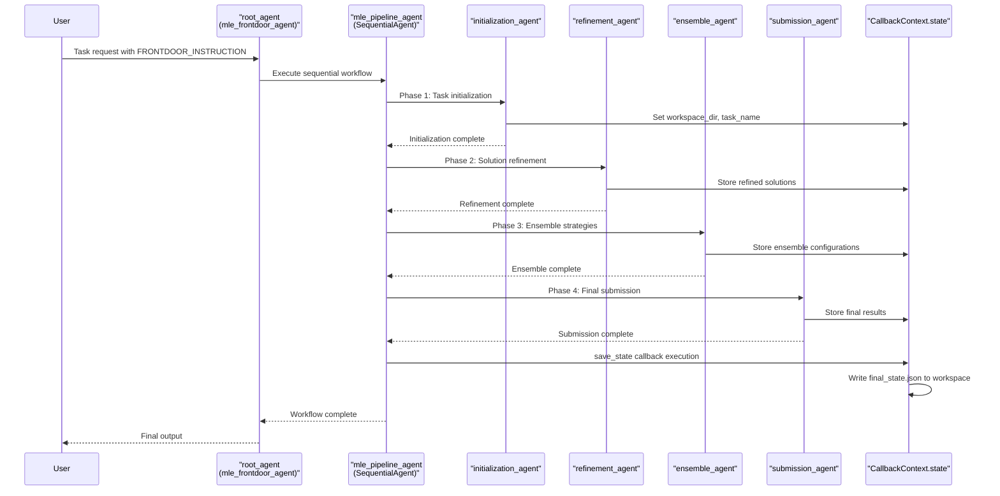
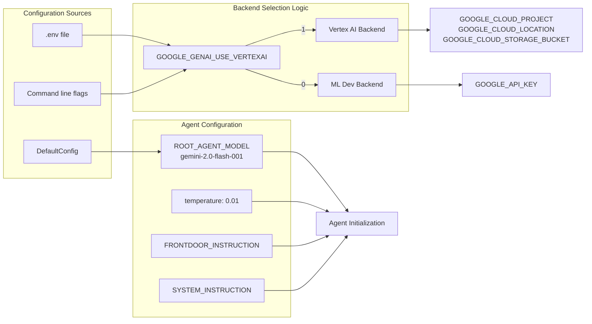
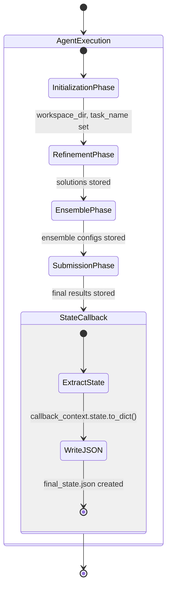
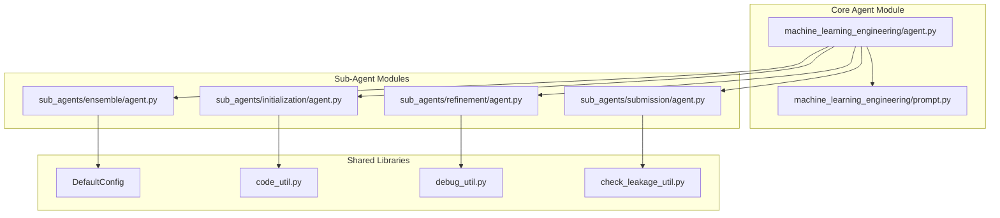

# System Architecture

<details>
<summary>Relevant source files</summary>

The following files were used as context for generating this wiki page:

- [machine-learning-engineering-architecture.svg](machine-learning-engineering-architecture.svg)
- [machine_learning_engineering/agent.py](machine_learning_engineering/agent.py)

</details>


This document describes the architectural design of the MLE-STAR (Machine Learning Engineering - Sequential Task Agent Runner) system, a multi-agent framework for automated machine learning engineering tasks. It covers the agent hierarchy, execution flow, configuration management, and integration patterns that enable the system to perform end-to-end ML engineering workflows.

For information about individual sub-agent implementations, see [Sub-Agents](#3). For deployment and cloud integration details, see [Deployment](#6).

## Overview

MLE-STAR implements a **sequential multi-agent architecture** where specialized agents collaborate to solve machine learning engineering tasks through a structured pipeline. The system follows a hierarchical agent pattern with a root coordinator and domain-specific sub-agents that execute in sequence.

### Core Architecture Pattern



Sources: [machine_learning_engineering/agent.py:30-50](), diagrams from provided architecture overview

## Agent Component Architecture

The system is structured around the `agents.SequentialAgent` pattern from Google's Agent Development Kit (ADK). Each component has specific responsibilities within the ML engineering workflow.

### Primary Components

| Component | Type | Role | Configuration |
|-----------|------|------|---------------|
| `root_agent` | `agents.Agent` | Entry point, instruction processing | `ROOT_AGENT_MODEL` environment variable |
| `mle_pipeline_agent` | `agents.SequentialAgent` | Orchestrates sub-agent execution | Sequential execution with state callbacks |
| `initialization_agent` | Domain Agent | Task setup and workspace preparation | Imported from `sub_agents.initialization` |
| `refinement_agent` | Domain Agent | Solution refinement and optimization | Imported from `sub_agents.refinement` |
| `ensemble_agent` | Domain Agent | Multiple solution combination | Imported from `sub_agents.ensemble` |
| `submission_agent` | Domain Agent | Final output preparation | Imported from `sub_agents.submission` |

### Agent Execution Flow



Sources: [machine_learning_engineering/agent.py:18-27](), [machine_learning_engineering/agent.py:30-40]()

## Configuration and Backend Selection

The system supports dual backend architecture enabling both cloud and local execution modes through environment-based configuration.

### Configuration Architecture



Sources: [machine_learning_engineering/agent.py:44](), [machine_learning_engineering/agent.py:46-47](), [machine_learning_engineering/agent.py:49]()

### Key Configuration Parameters

- **Model Selection**: `ROOT_AGENT_MODEL` environment variable controls the LLM backend
- **Temperature Control**: Fixed at `0.01` for deterministic outputs via `types.GenerateContentConfig`
- **Instruction System**: Dual-layer with `FRONTDOOR_INSTRUCTION` and `SYSTEM_INSTRUCTION`
- **Backend Toggle**: `GOOGLE_GENAI_USE_VERTEXAI` switches between Vertex AI and ML Dev APIs

## State Management and Persistence

The system implements comprehensive state management through ADK's `CallbackContext` with automatic persistence for debugging and resumption capabilities.

### State Flow Pattern



### State Persistence Implementation

The `save_state` function executes after each agent completion:

```python
def save_state(callback_context: callback_context_module.CallbackContext) -> Optional[types.Content]:
    workspace_dir = callback_context.state.get("workspace_dir", "")
    task_name = callback_context.state.get("task_name", "")
    run_cwd = os.path.join(workspace_dir, task_name)
    with open(os.path.join(run_cwd, "final_state.json"), "w") as f:
        json.dump(callback_context.state.to_dict(), f, indent=2)
```

Sources: [machine_learning_engineering/agent.py:18-27](), [machine_learning_engineering/agent.py:39]()

## Integration Points and Dependencies

The system integrates with multiple external systems and internal libraries to provide comprehensive ML engineering capabilities.

### External Dependencies

| System | Purpose | Configuration |
|--------|---------|---------------|
| Google ADK | Agent framework and orchestration | Core dependency |
| Vertex AI | Cloud-based LLM backend | `GOOGLE_GENAI_USE_VERTEXAI=1` |
| ML Dev API | API-based LLM backend | `GOOGLE_API_KEY` required |
| Google GenAI | Content generation and types | `types.GenerateContentConfig` |

### Internal Module Structure



Sources: [machine_learning_engineering/agent.py:10-13](), [machine_learning_engineering/agent.py:15]()

## Deployment and Runtime Architecture

The system supports both local development and cloud deployment through Vertex AI Agent Engine with comprehensive testing and monitoring capabilities.

### Runtime Execution Model

- **Local Development**: Direct agent execution via `adk run` commands
- **Cloud Deployment**: Vertex AI Agent Engine with session management  
- **Testing Integration**: AgentEvaluator with pytest framework for validation
- **State Persistence**: Automatic checkpoint creation for debugging and resumption

The architecture enables horizontal scaling through cloud deployment while maintaining development flexibility through local execution modes.

Sources: [machine_learning_engineering/agent.py:42-50](), deployment configuration from provided diagrams