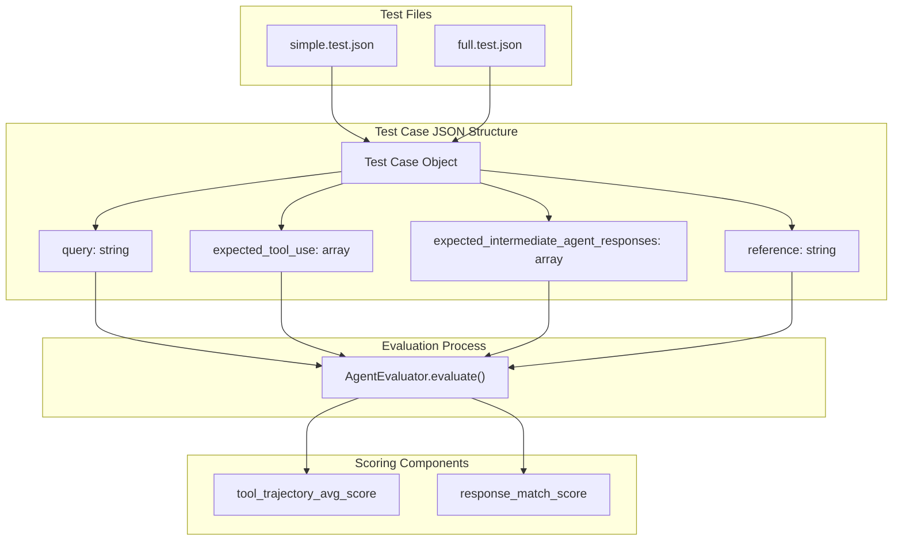
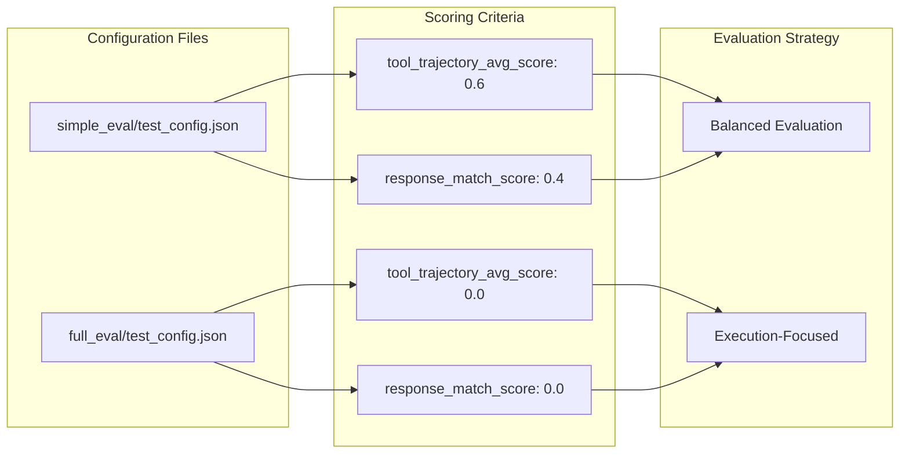
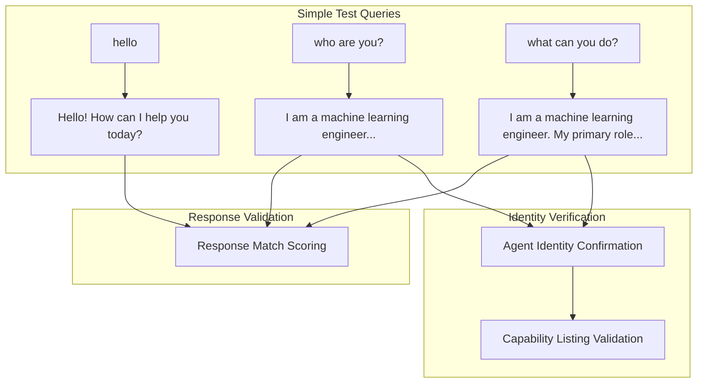
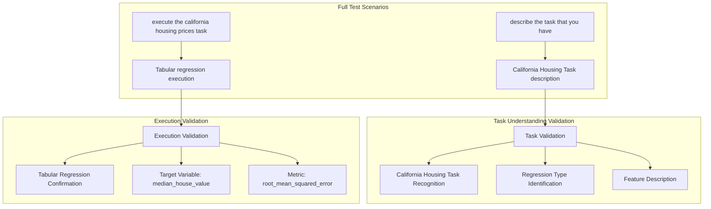
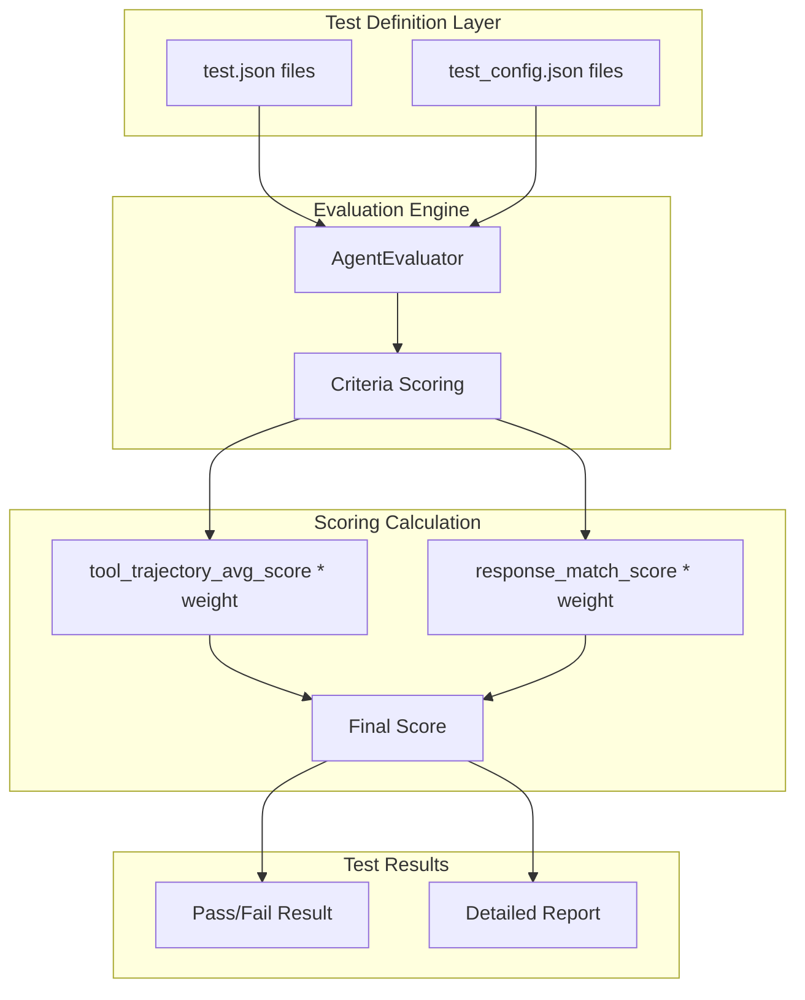

# Test Cases and Configuration

Relevant source files

The following files were used as context for generating this wiki page:

- [eval/full_eval/full.test.json](eval/full_eval/full.test.json)
- [eval/full_eval/test_config.json](eval/full_eval/test_config.json)
- [eval/simple_eval/simple.test.json](eval/simple_eval/simple.test.json)
- [eval/simple_eval/test_config.json](eval/simple_eval/test_config.json)

This document covers the test cases and configuration system used to evaluate the MLE-STAR agent's capabilities. The evaluation system provides two distinct test suites with different complexity levels and scoring criteria to validate both basic interactions and complex machine learning task execution.

For information about the test framework execution and AgentEvaluator integration, see [Test Framework](#5.1).

## Test Suite Types

The evaluation system implements two distinct test suites, each targeting different aspects of agent functionality:

### Simple Evaluation Suite

The simple evaluation suite focuses on basic conversational interactions and agent identity verification. It contains straightforward queries that test the agent's ability to respond appropriately to introductory questions.

**Test Cases:**
- Basic greeting interactions (`"hello"`)
- Identity verification (`"who are you?"`)
- Capability description (`"what can you do?"`)

**Configuration:** Uses balanced scoring with `tool_trajectory_avg_score: 0.6` and `response_match_score: 0.4` to emphasize both execution path and response quality.

Sources: [eval/simple_eval/simple.test.json:1-20](), [eval/simple_eval/test_config.json:1-8]()

### Full Evaluation Suite

The full evaluation suite targets complex machine learning task execution, specifically focusing on the California Housing regression task. These tests validate the agent's ability to understand and execute complete ML workflows.

**Test Cases:**
- Task description capabilities (`"describe the task that you have"`)
- Full task execution (`"execute the california housing prices task"`)

**Configuration:** Uses strict evaluation with both scoring criteria set to `0.0`, indicating these tests focus on successful execution rather than partial credit.

Sources: [eval/full_eval/full.test.json:1-14](), [eval/full_eval/test_config.json:1-6]()

## Test Case Structure

All test cases follow a standardized JSON structure that enables systematic evaluation through the AgentEvaluator framework:

**Field Descriptions:**

| Field | Purpose | Usage |
|-------|---------|-------|
| `query` | User input to test | Direct string passed to agent |
| `expected_tool_use` | Tools agent should invoke | Currently empty arrays in all tests |
| `expected_intermediate_agent_responses` | Sub-agent response expectations | Currently empty arrays in all tests |
| `reference` | Expected final response | Used for response matching evaluation |

Sources: [eval/simple_eval/simple.test.json:2-6](), [eval/full_eval/full.test.json:2-6]()

## Configuration and Scoring Criteria

The test configuration system uses JSON files to define evaluation criteria and scoring weights:

### Scoring Weight Analysis

| Test Suite | Tool Trajectory Weight | Response Match Weight | Strategy |
|------------|----------------------|---------------------|----------|
| Simple | 0.6 | 0.4 | Emphasizes correct execution path with response quality validation |
| Full | 0.0 | 0.0 | Binary pass/fail based on successful task completion |

**Tool Trajectory Score:** Measures whether the agent follows the expected sequence of tool invocations and sub-agent interactions.

**Response Match Score:** Evaluates similarity between the agent's final response and the reference response.

Sources: [eval/simple_eval/test_config.json:2-5](), [eval/full_eval/test_config.json:2-5]()

## Test Content Analysis

### Simple Test Suite Content

The simple evaluation focuses on establishing basic agent competency through conversational validation:

**Key Response Expectations:**
- Polite greeting acknowledgment
- Clear agent identity as "machine learning engineer"
- Accurate capability description including California Housing Task
- Reference to sequential sub-agent execution model

Sources: [eval/simple_eval/simple.test.json:6](), [eval/simple_eval/simple.test.json:12](), [eval/simple_eval/simple.test.json:18]()

### Full Test Suite Content

The full evaluation suite validates complex ML task understanding and execution:

**Critical Response Elements:**
- **Task Description:** Must reference "California Housing Task", "median house value prediction", and "regression problem"
- **Execution Response:** Must confirm "Tabular regression", target variable `median_house_value`, and RMSE metric

Sources: [eval/full_eval/full.test.json:6](), [eval/full_eval/full.test.json:12]()

## Test Configuration Integration

The test configuration system integrates with the broader evaluation framework through standardized JSON structure:

The evaluation system loads both test definitions and configuration files to create comprehensive test scenarios that validate different aspects of agent functionality, from basic conversational capabilities to complex ML task execution.

Sources: [eval/simple_eval/test_config.json:1-8](), [eval/full_eval/test_config.json:1-6]()