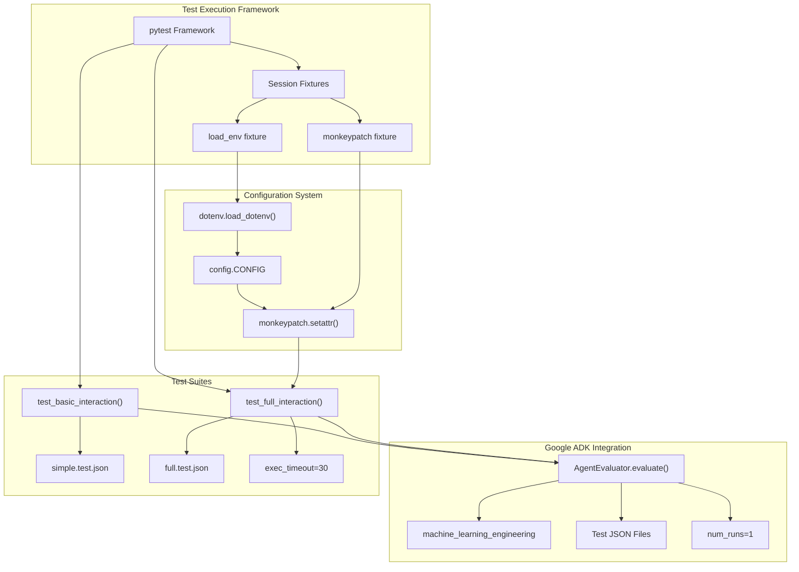
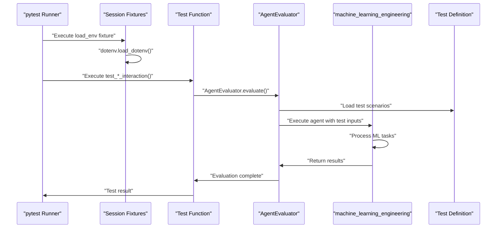
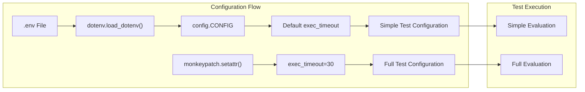

# Test Framework

Relevant source files

The following files were used as context for generating this wiki page:

- [eval/full_eval/test_eval.py](eval/full_eval/test_eval.py)
- [eval/simple_eval/test_eval.py](eval/simple_eval/test_eval.py)

The Test Framework provides automated evaluation capabilities for the MLE-STAR machine learning engineering agent system. It integrates with Google's Agent Development Kit (ADK) evaluation framework to run comprehensive tests that validate agent performance across different task complexity levels.

For information about test scenarios and evaluation criteria, see [Test Cases and Configuration](#5.2). For deployment testing of live agents, see [Testing Deployed Agents](#6.2).

## Framework Architecture

The test framework is built around the `AgentEvaluator` class from Google ADK and uses pytest as the test runner. The system supports two evaluation modes: simple evaluation for basic functionality and full evaluation for comprehensive testing.

### Test Framework Components

**Sources:** [eval/full_eval/test_eval.py:1-29](), [eval/simple_eval/test_eval.py:1-28]()

### Test Execution Flow

The test framework follows a consistent execution pattern across both simple and full evaluation modes:

**Sources:** [eval/full_eval/test_eval.py:15-28](), [eval/simple_eval/test_eval.py:15-27]()

## Test Implementation Details

### Session-Level Fixtures

Both test suites use identical session-level fixtures for environment setup:

| Fixture | Purpose | Scope | Auto-use |
|---------|---------|-------|----------|
| `load_env` | Loads environment variables via `dotenv.load_dotenv()` | session | Yes |

The `load_env` fixture [eval/full_eval/test_eval.py:15-17]() ensures that environment configuration is available before any tests execute.

### Test Functions

#### Simple Evaluation Test

The `test_basic_interaction` function [eval/simple_eval/test_eval.py:20-27]() executes basic agent functionality tests:

- **Target Agent**: `"machine_learning_engineering"`
- **Test Definition**: `"./simple.test.json"`
- **Execution Count**: `num_runs=1`
- **Timeout**: Uses default configuration

#### Full Evaluation Test

The `test_full_interaction` function [eval/full_eval/test_eval.py:20-28]() executes comprehensive agent testing:

- **Target Agent**: `"machine_learning_engineering"`
- **Test Definition**: `"./full.test.json"`
- **Execution Count**: `num_runs=1`
- **Timeout Override**: `exec_timeout=30` via `monkeypatch.setattr(config.CONFIG, "exec_timeout", 30)`

### Configuration Management

The test framework integrates with the shared configuration system:

**Sources:** [eval/full_eval/test_eval.py:9,16-17,23](), [eval/simple_eval/test_eval.py:9,16-17]()

## AgentEvaluator Integration

The framework leverages Google ADK's `AgentEvaluator` class for agent execution and evaluation:

### Evaluation Parameters

| Parameter | Type | Purpose |
|-----------|------|---------|
| `agent_name` | `str` | Target agent identifier (`"machine_learning_engineering"`) |
| `test_file` | `str` | Path to JSON test definition file |
| `num_runs` | `int` | Number of evaluation runs (set to `1`) |

### Path Resolution

Test definition files are resolved using `pathlib.Path(__file__).parent` to locate JSON files relative to the test script:

- Simple tests: [eval/simple_eval/test_eval.py:25]()
- Full tests: [eval/full_eval/test_eval.py:26]()

## Async Test Support

Both test suites are configured for asynchronous execution:

- **pytest Plugin**: `pytest_plugins = ("pytest_asyncio",)` [eval/full_eval/test_eval.py:12]()
- **Test Decorators**: `@pytest.mark.asyncio` [eval/full_eval/test_eval.py:20]()
- **Async Functions**: `async def test_*_interaction()` pattern

This enables proper handling of the asynchronous `AgentEvaluator.evaluate()` method calls.

**Sources:** [eval/full_eval/test_eval.py:12,20-21](), [eval/simple_eval/test_eval.py:12,20-21]()