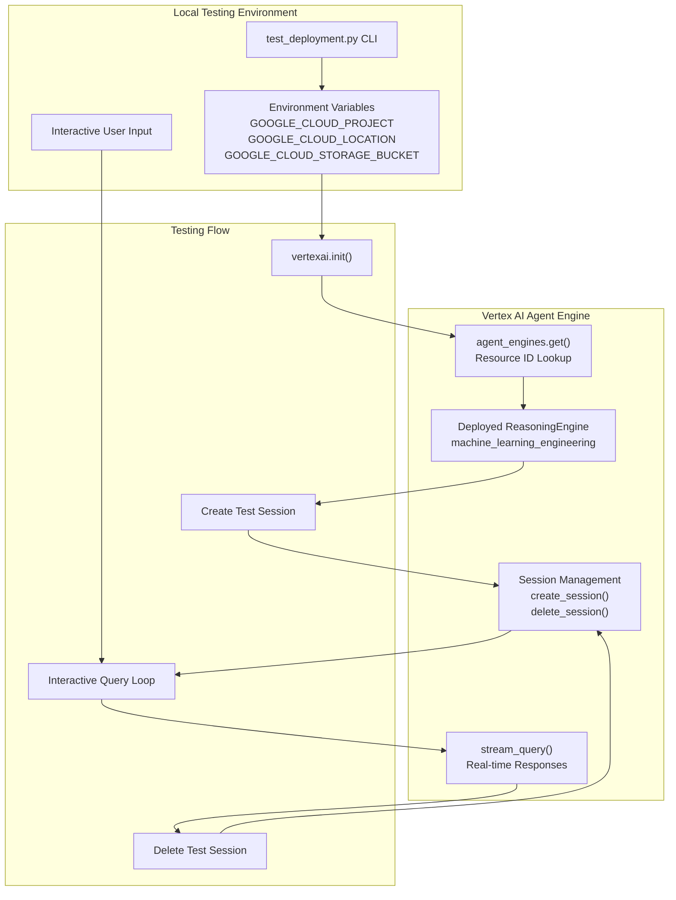
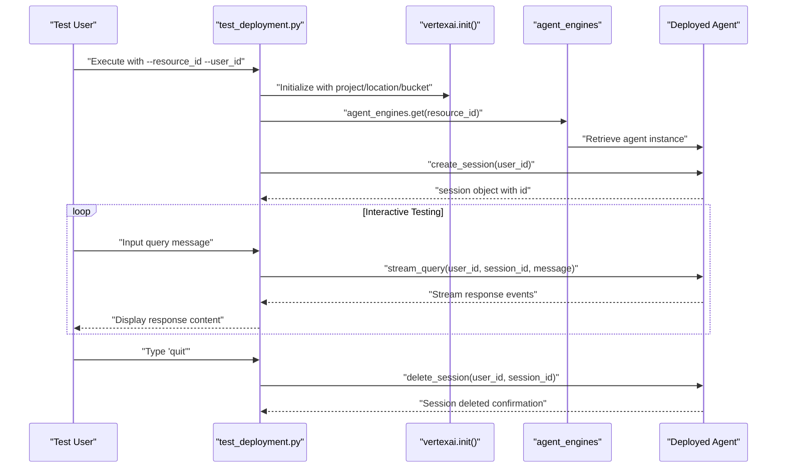
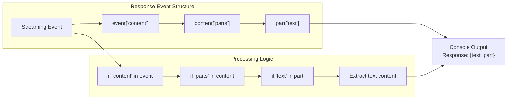

# Testing Deployed Agents

<details>
<summary>Relevant source files</summary>

The following files were used as context for generating this wiki page:

- [deployment/test_deployment.py](deployment/test_deployment.py)

</details>


## Purpose and Scope

This page covers the interactive testing framework for Machine Learning Engineering agents that have been deployed to Google Cloud Vertex AI Agent Engine. It focuses on validating deployed agent functionality through session-based interactions and real-time query streaming.

For information about the deployment process itself, see [Vertex AI Deployment](#6.1). For evaluation of agents during development, see [Evaluation System](#5).

## Overview

The testing system provides an interactive command-line interface for validating deployed agents in their production environment. It enables real-time conversations with deployed agents through Vertex AI Agent Engine's session management and streaming query capabilities.

The testing framework supports:
- Session-based interactions with deployed agents
- Real-time streaming responses
- Manual validation of agent behavior
- Session lifecycle management

Sources: [deployment/test_deployment.py:1-91]()

## Configuration Requirements

### Environment Variables

The system requires the same Google Cloud configuration used for deployment:

| Variable | Purpose | Required |
|----------|---------|----------|
| `GOOGLE_CLOUD_PROJECT` | GCP project containing the deployed agent | Yes |
| `GOOGLE_CLOUD_LOCATION` | Region where the agent is deployed | Yes |
| `GOOGLE_CLOUD_STORAGE_BUCKET` | Storage bucket for agent artifacts | Yes |

### Command Line Parameters

```bash
python deployment/test_deployment.py \
  --resource_id=<reasoning_engine_resource_id> \
  --user_id=<test_user_identifier>
```

| Parameter | Description | Required |
|-----------|-------------|----------|
| `resource_id` | ReasoningEngine resource ID returned from deployment | Optional (can be provided via flags) |
| `user_id` | Arbitrary string identifying the test user | Yes |
| `project_id` | Override for GOOGLE_CLOUD_PROJECT | Optional |
| `location` | Override for GOOGLE_CLOUD_LOCATION | Optional |
| `bucket` | Override for GOOGLE_CLOUD_STORAGE_BUCKET | Optional |

Sources: [deployment/test_deployment.py:12-21](), [deployment/test_deployment.py:28-44]()

## Interactive Testing Workflow

### Test Deployment Architecture



Sources: [deployment/test_deployment.py:58-86]()

### Session Lifecycle Management



Sources: [deployment/test_deployment.py:64-86]()

## Interactive Testing Interface

### Query Processing

The testing interface implements an interactive loop that processes user queries and streams responses:

1. **Input Collection**: Accepts user input via `input()` prompt
2. **Query Streaming**: Uses `stream_query()` to send messages to the deployed agent
3. **Response Processing**: Extracts and displays text content from streaming events
4. **Session Termination**: Exits on 'quit' command and cleans up session

```python
# Key interaction pattern from test_deployment.py:69-84
while True:
    user_input = input("Input: ")
    if user_input == "quit":
        break
    
    for event in agent.stream_query(
        user_id=FLAGS.user_id, 
        session_id=session["id"], 
        message=user_input
    ):
        # Process streaming response events
```

Sources: [deployment/test_deployment.py:69-84]()

### Response Format Processing

The system handles structured response events from the Agent Engine:



Sources: [deployment/test_deployment.py:77-83]()

## Configuration Resolution

The system implements a dual-source configuration pattern that prioritizes command-line flags over environment variables:

| Configuration Item | Priority 1 (Command Line) | Priority 2 (Environment) |
|-------------------|---------------------------|--------------------------|
| Project ID | `--project_id` | `GOOGLE_CLOUD_PROJECT` |
| Location | `--location` | `GOOGLE_CLOUD_LOCATION` |
| Storage Bucket | `--bucket` | `GOOGLE_CLOUD_STORAGE_BUCKET` |

### Configuration Validation

The system performs validation checks and provides descriptive error messages for missing required configuration:

```python
# Configuration validation pattern from test_deployment.py:46-56
if not project_id:
    print("Missing required environment variable: GOOGLE_CLOUD_PROJECT")
    return
elif not location:
    print("Missing required environment variable: GOOGLE_CLOUD_LOCATION") 
    return
elif not bucket:
    print("Missing required environment variable: GOOGLE_CLOUD_STORAGE_BUCKET")
    return
```

Sources: [deployment/test_deployment.py:28-56]()

## Usage Examples

### Basic Testing Session

```bash
# Set up environment
export GOOGLE_CLOUD_PROJECT="your-project"
export GOOGLE_CLOUD_LOCATION="us-central1"
export GOOGLE_CLOUD_STORAGE_BUCKET="your-bucket"

# Start interactive testing
python deployment/test_deployment.py \
  --resource_id="projects/123/locations/us-central1/reasoningEngines/456" \
  --user_id="test-user-001"
```

### Typical Interaction Flow

```
Found agent with resource ID: projects/123/locations/us-central1/reasoningEngines/456
Created session for user ID: test-user-001
Type 'quit' to exit.
Input: Analyze the California housing dataset and build a regression model
Response: I'll help you analyze the California housing dataset and build a regression model...
Input: What preprocessing steps did you apply?
Response: I applied the following preprocessing steps...
Input: quit
Deleted session for user ID: test-user-001
```

Sources: [deployment/test_deployment.py:65-86]()
