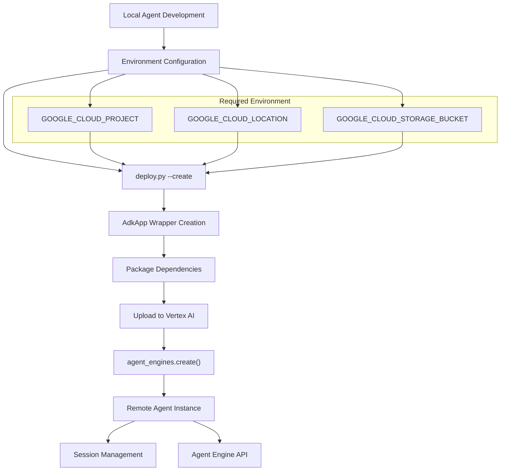
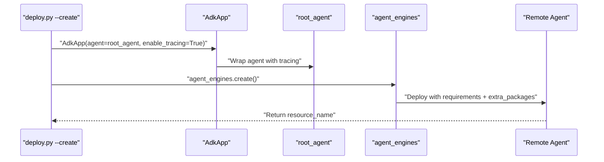
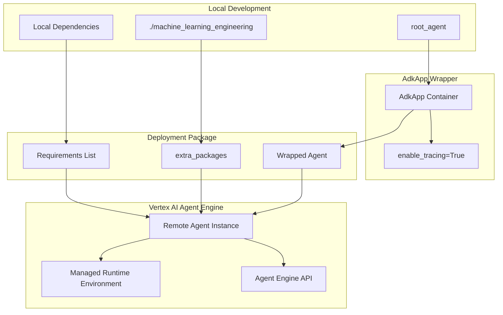

# Vertex AI Deployment

<details>
<summary>Relevant source files</summary>

The following files were used as context for generating this wiki page:

- [deployment/deploy.py](deployment/deploy.py)

</details>


This document covers the deployment of the MLE-STAR machine learning engineering agent to Google Cloud's Vertex AI Agent Engine platform. It includes configuration requirements, CLI operations for managing deployed agents, and the packaging process for cloud deployment.

For information about testing deployed agents after deployment, see [Testing Deployed Agents](#6.2). For general system configuration and setup, see [Configuration and Setup](#1.2).

## Overview

The Vertex AI deployment system enables the MLE-STAR agent to run as a managed service on Google Cloud Platform. The deployment process packages the local agent code, dependencies, and configuration into a remote agent instance that can be accessed via the Vertex AI Agent Engine API.

The deployment script provides three core operations:
- **Create**: Deploy a new agent instance to Vertex AI
- **List**: View all deployed agent instances  
- **Delete**: Remove existing agent instances

## Deployment Workflow



Sources: [deployment/deploy.py:1-126]()

## Configuration Requirements

The deployment system requires three essential Google Cloud Platform environment variables:

| Environment Variable | Purpose | Example |
|---------------------|---------|---------|
| `GOOGLE_CLOUD_PROJECT` | Target GCP project for deployment | `my-ml-project` |
| `GOOGLE_CLOUD_LOCATION` | GCP region for agent deployment | `us-central1` |
| `GOOGLE_CLOUD_STORAGE_BUCKET` | Staging bucket for deployment artifacts | `ml-agent-staging` |

These can be provided either through environment variables or command-line flags. The deployment script validates all required configuration before proceeding with any operations.

Sources: [deployment/deploy.py:75-103]()

## CLI Operations

### Create Agent

The `create()` function deploys a new agent instance by wrapping the `root_agent` in an `AdkApp` container and uploading it to Vertex AI Agent Engine.



The create operation includes comprehensive dependency specification:

**Core Requirements**:
- `google-adk` (>=1.5.0)
- `google-cloud-aiplatform[adk,agent_engines]` (>=1.93.0)
- `google-genai` (>=1.5.0,<2.0.0)

**ML Dependencies**:
- `numpy`, `pandas`, `scikit-learn`, `scipy`
- `lightgbm` for gradient boosting
- `torch` (CPU-optimized build)

**Extra Packages**:
- `./machine_learning_engineering` (local source code)

Sources: [deployment/deploy.py:25-50]()

### List Agents

The `list_agents()` function enumerates all deployed agent instances in the current project and location, displaying their metadata including creation and update timestamps.

### Delete Agent

The `delete()` function removes a specific agent instance by resource ID. It uses force deletion to ensure complete cleanup of the remote agent.

Sources: [deployment/deploy.py:52-68]()

## Agent Packaging Architecture



The packaging process transforms the local `root_agent` into a cloud-deployable service by:

1. **Wrapping** the agent in an `AdkApp` container with tracing enabled
2. **Specifying** all required Python dependencies and versions
3. **Including** the local source code as an extra package
4. **Uploading** the complete package to Vertex AI Agent Engine

Sources: [deployment/deploy.py:27-48]()

## Command Line Interface

The deployment script supports the following command patterns:

```bash
# Create new agent deployment
python deployment/deploy.py --create

# List all deployed agents  
python deployment/deploy.py --list

# Delete specific agent by resource ID
python deployment/deploy.py --delete --resource_id <resource_id>

# Override environment variables via flags
python deployment/deploy.py --create --project_id my-project --location us-central1 --bucket my-bucket
```

The CLI uses `absl.flags` for argument parsing and enforces mutual exclusion between create and delete operations to prevent accidental conflicts.

Sources: [deployment/deploy.py:13-22](), [deployment/deploy.py:71-125]()